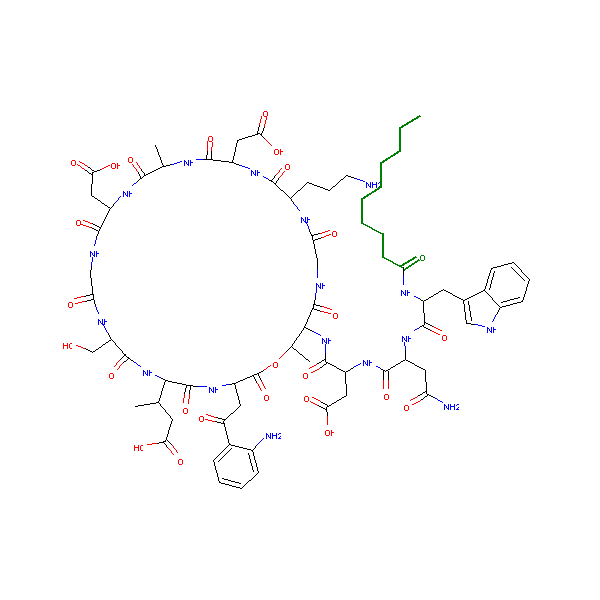
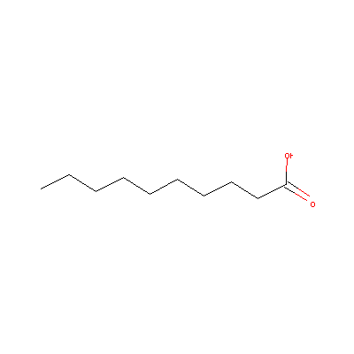

Given the smiles of a molecule and the smiles of a possible substructure, find the atoms of the substructure in the molecule.
Visualize the molecule with the substructure atoms highlighted in green.


## Functions to convert smiles to molecules, find maximum common substructure and visualize the atoms.

```python
import rdkit
import rdkit.Chem as Chem
from rdkit.Chem import rdFMCS
from matplotlib import colors
from rdkit.Chem.Draw import MolToImage

def get_mol(smiles):
    mol = Chem.MolFromSmiles(smiles)
    if mol is None:
        return None
    Chem.Kekulize(mol)
    return mol


def find_matches_one(mol,submol):
    #find all matching atoms for each submol in submol_list in mol.
    match_dict = {}
    mols = [mol,submol] #pairwise search
    res=rdFMCS.FindMCS(mols) #,ringMatchesRingOnly=True)
    mcsp = Chem.MolFromSmarts(res.smartsString)
    matches = mol.GetSubstructMatches(mcsp)
    return matches

#Draw the molecule
def get_image(mol,atomset=None):    
    hcolor = colors.to_rgb('green')
    if atomset is not None:
        #highlight the atoms set while drawing the whole molecule.
        img = MolToImage(mol, size=(600, 600),fitImage=True, highlightAtoms=atomset,highlightColor=hcolor)
    else:
        img = MolToImage(mol, size=(400, 400),fitImage=True)
    return img

peptide_smi = 'CCCCCCCCCC(=O)NC(Cc1c[nH]c2ccccc12)C(=O)NC(CC(N)=O)C(=O)NC(CC(=O)O)C(=O)NC4C(C)OC(=O)C(CC(=O)c3ccccc3(N))NC(=O)C(NC(=O)C(CO)NC(=O)CNC(=O)C(CC(=O)O)NC(=O)C(C)NC(=O)C(CC(=O)O)NC(=O)C(CCCN)NC(=O)CNC4(=O))C(C)CC(=O)O'
monomer_smi = 'CCCCCCCCCC(=O)O'

peptide_mol = get_mol(peptide_smi) #whole molecule
monomer_mol = get_mol(monomer_smi) #substructure molecule

matches = find_matches_one(peptide_mol,monomer_mol)

atomset = list(matches[0])
#print(atomset)
```
## Visuzlize the molecule with the substructure atoms in dark green.



```python
img = get_image(peptide_mol,atomset)
img #see the whole molecule with the substructure highlighted.
```


## Visualize the substructure molecule alone.

```python
img = get_image(monomer_mol)
img #see the whole molecule with the substructure highlighted.
```


