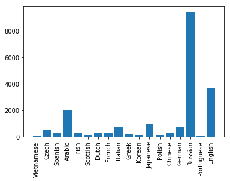
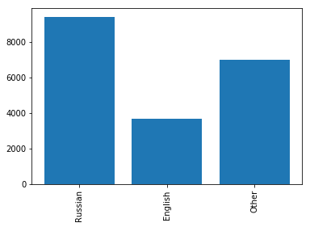

Implements simple character level name classification using Keras LSTM and Dense layers. Training is done using about 20K names across 18 languages. The names are clubbed into three categories : English, Russian, Other for simplicity. Using SGD as optimizer produces poor results, Adam performs better, Nadam even better.

Also implements the same using pytorch (see a related post), be careful of initializating the LSTM properly when using pytorch, unlike Keras, a proper initialization of the LSTM parameters is not automatically done for you.


```python
from keras.models import Model, Input
import keras.backend as K
from keras.optimizers import Nadam, SGD, Adam
from keras.models import Sequential
from keras.layers import Dense
from keras.layers import LSTM
import os
import sys
import numpy as np
from keras.utils import to_categorical
import tensorflow as tf
```

    Using TensorFlow backend.


```python
os.environ["CUDA_DEVICE_ORDER"]="PCI_BUS_ID";

# The GPU id to use, usually either "0" or "1";
os.environ["CUDA_VISIBLE_DEVICES"]="0";
```


```python
import glob
import random
import string
import unicodedata
import matplotlib.pyplot as plt
import matplotlib.ticker as ticker
import time
import math
```


```python
random.seed(30)
```


```python
def findFiles(path): 
    return glob.glob(path)

# Turn a Unicode string to plain ASCII, thanks to https://stackoverflow.com/a/518232/2809427
def unicodeToAscii(s):
    return ''.join(
        c for c in unicodedata.normalize('NFD', s)
        if unicodedata.category(c) != 'Mn'
        and c in all_chars
    )

# Read a file and split into lines
def readLines(filename):
    lines = open(filename, encoding='utf-8').read().strip().split('\n')
    return [unicodeToAscii(line) for line in lines]
```


```python
print('all training files=',findFiles('data/names/*.txt'))

pad_char = '#'
all_chars = string.ascii_letters + " .,;'" + pad_char
n_chars = len(all_chars)

print(unicodeToAscii('Ślusàrski'))

# Build the category_names dictionary, a list of names per language
category_names_dict = {}
all_categories = []

name_counts = []
for filename in findFiles('data/names/*.txt'):
    category = os.path.splitext(os.path.basename(filename))[0]
    all_categories.append(category)
    names = readLines(filename)
    category_names_dict[category] = names
    name_counts.append(len(names))

num_samples = np.sum(name_counts)
n_categories = len(all_categories)

print('Total ',num_samples,'names across',n_categories,'categories')
```

    all training files= ['data/names/Vietnamese.txt', 'data/names/Czech.txt', 'data/names/Spanish.txt', 'data/names/Arabic.txt', 'data/names/Irish.txt', 'data/names/Scottish.txt', 'data/names/Dutch.txt', 'data/names/French.txt', 'data/names/Italian.txt', 'data/names/Greek.txt', 'data/names/Korean.txt', 'data/names/Japanese.txt', 'data/names/Polish.txt', 'data/names/Chinese.txt', 'data/names/German.txt', 'data/names/Russian.txt', 'data/names/Portuguese.txt', 'data/names/English.txt']
    Slusarski
    Total  20074 names across 18 categories


```python
print('No of characters, this is the encoding dimension of each character in a name : ',n_chars)
```

    No of characters, this is the encoding dimension of each character in a name :  58


```python
print('all_categories=',all_categories,'\n')
print('category "English" has ',len(category_names_dict['English']),'names')
print(category_names_dict['English'][:5])
```

    all_categories= ['Vietnamese', 'Czech', 'Spanish', 'Arabic', 'Irish', 'Scottish', 'Dutch', 'French', 'Italian', 'Greek', 'Korean', 'Japanese', 'Polish', 'Chinese', 'German', 'Russian', 'Portuguese', 'English'] 
    
    category "English" has  3668 names
    ['Abbas', 'Abbey', 'Abbott', 'Abdi', 'Abel']


```python
labels = list(category_names_dict.keys())
values = [len(names) for names in category_names_dict.values()]

plt.xticks(rotation=90)
centers = range(len(values))
plt.bar(centers, values, align='center', tick_label=labels)
plt.show()

for i,ll in enumerate(labels):
    print(ll,values[i])
```

{:height="100%" width="100%"} |
<!--  -->


    Vietnamese 73
    Czech 519
    Spanish 298
    Arabic 2000
    Irish 232
    Scottish 100
    Dutch 297
    French 277
    Italian 709
    Greek 203
    Korean 94
    Japanese 991
    Polish 139
    Chinese 268
    German 724
    Russian 9408
    Portuguese 74
    English 3668


```python
category_names_dict['Other'] = []
to_skip = ['English','Russian','Other']
for k,v in category_names_dict.items():
    print('['+k,']',sep='')
    k = k.strip()
    if k not in to_skip:
        print(k)
        print(k is not 'English' and k is not 'Russian')
        print('Adding ',k,len(v))
        category_names_dict['Other'].extend(v)
        print(len(category_names_dict['Other']))
        print('---------------')
    else:
        print('skip')
        print('------------------')
        
category_names_dict = {i:category_names_dict[i] for i in category_names_dict if i in to_skip}

labels = list(category_names_dict.keys())
values = [len(names) for names in category_names_dict.values()]

plt.xticks(rotation=90)
centers = range(len(values))
plt.bar(centers, values, align='center', tick_label=labels)
plt.show()

for i,ll in enumerate(labels):
    print(ll,values[i])
    
all_categories = list(category_names_dict.keys())
n_categories = len(all_categories)
```

    [Vietnamese]
    Vietnamese
    True
    Adding  Vietnamese 73
    73
    ---------------
    [Czech]
    Czech
    True
    Adding  Czech 519
    592
    ---------------
    [Spanish]
    Spanish
    True
    Adding  Spanish 298
    890
    ---------------
    [Arabic]
    Arabic
    True
    Adding  Arabic 2000
    2890
    ---------------
    [Irish]
    Irish
    True
    Adding  Irish 232
    3122
    ---------------
    [Scottish]
    Scottish
    True
    Adding  Scottish 100
    3222
    ---------------
    [Dutch]
    Dutch
    True
    Adding  Dutch 297
    3519
    ---------------
    [French]
    French
    True
    Adding  French 277
    3796
    ---------------
    [Italian]
    Italian
    True
    Adding  Italian 709
    4505
    ---------------
    [Greek]
    Greek
    True
    Adding  Greek 203
    4708
    ---------------
    [Korean]
    Korean
    True
    Adding  Korean 94
    4802
    ---------------
    [Japanese]
    Japanese
    True
    Adding  Japanese 991
    5793
    ---------------
    [Polish]
    Polish
    True
    Adding  Polish 139
    5932
    ---------------
    [Chinese]
    Chinese
    True
    Adding  Chinese 268
    6200
    ---------------
    [German]
    German
    True
    Adding  German 724
    6924
    ---------------
    [Russian]
    skip
    ------------------
    [Portuguese]
    Portuguese
    True
    Adding  Portuguese 74
    6998
    ---------------
    [English]
    skip
    ------------------
    [Other]
    skip
    ------------------


{:height="100%" width="100%"} |
<!--  -->


    Russian 9408
    English 3668
    Other 6998


```python
print(all_categories)
print(n_categories)
```

    ['Russian', 'English', 'Other']
    3


```python
# Find char index from all_chars, e.g. "a" = 0
def charToIndex(char):
    return all_chars.find(char)

# Just for demonstration, turn a char into a <1 x n_chars> Tensor
def charToTensor_one_hot(char):
    tensor = np.zeros((1, n_chars))
    tensor[0][charToIndex(char)] = 1
    return tensor

def charToTensor(char):
    tensor = np.zeros(1,dtype=np.long)
    tensor[0] = charToIndex(char)
    return tensor

# Turn a line into a <line_length x 1 x n_chars>,
# or an array of one-hot char vectors
def seqToTensor_one_hot(seq):
    tensor = np.zeros((len(seq),1, n_chars))
    for idx, char in enumerate(seq):
        tensor[idx][0][charToIndex(char)] = 1
    return tensor

def seqToTensor(seq):
    tensor = np.zeros(len(seq), dtype=np.long)
    for idx, char in enumerate(seq):
        tensor[idx] = int(charToIndex(char))
    return tensor


print('J=',charToTensor_one_hot('J').shape)

print('Jones=',seqToTensor_one_hot('Jones').shape)

print('\n pad_char=',pad_char,charToTensor_one_hot(pad_char))
```

    J= (1, 58)
    Jones= (5, 1, 58)
    
     pad_char= # [[0. 0. 0. 0. 0. 0. 0. 0. 0. 0. 0. 0. 0. 0. 0. 0. 0. 0. 0. 0. 0. 0. 0. 0.
      0. 0. 0. 0. 0. 0. 0. 0. 0. 0. 0. 0. 0. 0. 0. 0. 0. 0. 0. 0. 0. 0. 0. 0.
      0. 0. 0. 0. 0. 0. 0. 0. 0. 1.]]


### Batch data generator


```python
def batch_data_generator(all_categories, category_names_dict, batch_size, n_chars, pad_char, shuffle):
    
    #flatten the dictionary to a list of tuples.
    dict_tuples = []
    for category,names in category_names_dict.items():
        for nm in names:
            dict_tuples.append((category,nm))
    
    num_samples = len(dict_tuples)
    num_batches = num_samples // batch_size
    
    print('batch_data_generator: num_samples =',num_samples,'num_batches = ',num_batches)
    
    epoch_num = 0
    n_cat = len(category_names_dict)
    
    while(True):
        
        if shuffle:
            random.shuffle(dict_tuples)
            random.shuffle(dict_tuples)
        indices = np.arange(num_samples)
        
        for batch_id in range(num_batches): #for each batch of names
            batch_indices = indices[batch_id * batch_size : (batch_id + 1) * batch_size]

            max_seqlen = 0 #max length of names in a batch.
            batch_names = []
            batch_labels = []
            batch_categories = []    
            name_tensors = []
            
            for b_ind in batch_indices:
                a_name = dict_tuples[b_ind][1]            #'Alex'
                category = dict_tuples[b_ind][0]          #'English'
                label = all_categories.index(category)    #17
                name_tensor = seqToTensor_one_hot(a_name)
                max_seqlen = name_tensor.shape[0] if name_tensor.shape[0] >= max_seqlen else max_seqlen
                batch_names.append(a_name)
                batch_labels.append(label)
                batch_categories.append(category)
                name_tensors.append(np.squeeze(name_tensor))

            #for nt in name_tensors:    
            #    print('name_tensor=',nt.shape)
                
            #convert the batch list of tuples to tensors.
            #Put all the selected names into a single tensor for input to RNN          
            pad_char_tensor = charToTensor_one_hot(pad_char) #tensor corresponding to pad_char            
            #create a tensor of size [batch_size x max_seqlen x n_char] filled with pad_char
            batch_names_tensor = np.broadcast_to(
                pad_char_tensor,(batch_size, max_seqlen, pad_char_tensor.shape[1])
                ).copy()
            
            #print('batch_names_tensor',batch_names_tensor.shape)
            
            for i,name_tensor in enumerate(name_tensors):
                num_chars = name_tensor.shape[0]
                #print(num_chars,'assigning',name_tensor.shape,'to',batch_names_tensor[i,0:num_chars,:].shape)
                batch_names_tensor[i,-num_chars:,:] = name_tensor #Left padding is done with pad_char
            
            batch_names_tensor = np.array(np.squeeze(batch_names_tensor))
            
            batch_labels_one_hot = np.array(to_categorical(batch_labels, num_classes=n_cat))
            
            yield(batch_names_tensor, batch_labels_one_hot)
            
        #done looping through all batches.
        #go to the top and permute the file indices.
        epoch_num += 1
```


```python
print('Number of name categories, this is the no. of output categories = ',n_categories)
```

    Number of name categories, this is the no. of output categories =  3


### Generate 1 batch of data to test Keras model building


```python
n_hidden = 4
batch_size = 5
shuffle = True

batch_generator = batch_data_generator(all_categories, category_names_dict, batch_size, n_chars, pad_char, shuffle)
batch_names_tensor, batch_labels_tensor_one_hot = next(batch_generator)

print("batch_names_tensor",batch_names_tensor.shape)
print("batch_labels_tensor_one_hot",batch_labels_tensor_one_hot.shape)

print("\nbatch_labels_tensor_one_hot =\n",batch_labels_tensor_one_hot)
```

    batch_data_generator: num_samples = 20074 num_batches =  4014
    batch_names_tensor (5, 10, 58)
    batch_labels_tensor_one_hot (5, 3)
    
    batch_labels_tensor_one_hot =
     [[1. 0. 0.]
     [0. 0. 1.]
     [0. 1. 0.]
     [0. 0. 1.]
     [0. 1. 0.]]


## A way to use Keras to build a model for character level LSTM


```python
def build_model_1(n_hidden, n_chars, n_categories):
    inputs = Input(shape=(None, n_chars)) #n_chars = feature size
    lstm = LSTM(n_hidden)(inputs)
    dense = Dense(n_categories, activation='softmax')(lstm)
    model = Model(inputs=inputs, outputs=dense)
    model.compile(loss='categorical_crossentropy', optimizer='adam', metrics=['accuracy'])
    
    #initialize hidden states, not sure if the initialization works.
    #layer[1] is LSTM
    hidden_states = K.variable(value=np.zeros([1, n_hidden]))
    cell_states = K.variable(value=np.zeros([1, n_hidden]))
    model.layers[1].states[0] = hidden_states
    model.layers[1].states[1] = cell_states 
    
    # This initialization also compiles without errors. 
    #c_0 = tf.convert_to_tensor(np.zeros([1, n_hidden]).astype(np.float32))
    #h_0 = tf.convert_to_tensor(np.zeros([1, n_hidden]).astype(np.float32))
    #model.layers[1].states[0] = h_0
    #model.layers[1].states[1] = c_0

    print('--------------Model summary--------------')
    model.summary()
    return model

model1 = build_model_1(n_hidden, n_chars, n_categories)
X_input = tf.placeholder(tf.float32, shape=(None, None, n_chars))
y_output = model1(X_input)

X = batch_names_tensor
y_true = batch_labels_tensor_one_hot

y_pred = model1.predict(X)
print('y_pred = \n',y_pred)
```

    --------------Model summary--------------
    _________________________________________________________________
    Layer (type)                 Output Shape              Param #   
    =================================================================
    input_1 (InputLayer)         (None, None, 58)          0         
    _________________________________________________________________
    lstm_1 (LSTM)                (None, 4)                 1008      
    _________________________________________________________________
    dense_1 (Dense)              (None, 3)                 15        
    =================================================================
    Total params: 1,023
    Trainable params: 1,023
    Non-trainable params: 0
    _________________________________________________________________
    y_pred = 
     [[0.3196215  0.3282915  0.35208696]
     [0.3212379  0.32976478 0.3489973 ]
     [0.32440522 0.34431443 0.33128032]
     [0.35378945 0.349261   0.29694957]
     [0.30627587 0.33516407 0.35856003]]


### Print predictions and accuracy comparing with true labels


```python
sess = K.get_session()
top_n, top_i = tf.nn.top_k(y_pred, k=1)
top_values, top_indices = sess.run(tf.nn.top_k(y_pred, k=1))
print('y_pred      = ',np.squeeze(top_indices))

batch_labels_tensor = np.argmax(batch_labels_tensor_one_hot,axis=1)
print('true_labels = ',batch_labels_tensor)

#Calculate accuracy of each prediction using Keras metrics
metric = tf.keras.metrics.categorical_accuracy(y_true,y_pred)
print('Accuracy = ',sess.run(metric))
```

    y_pred      =  [2 2 1 0 2]
    true_labels =  [0 2 1 2 1]
    Accuracy =  [0. 1. 1. 0. 0.]


## Another way to use Keras to build a model for character level LSTM


```python
def build_model_2(n_hidden, n_chars, n_categories):
    model = Sequential()
    lstm = LSTM(n_hidden, input_shape=(None,n_chars)) #n_chars = feature size.
    model.add(lstm)
    model.add(Dense(n_categories, activation='softmax'))
    
    #initialize hidden states, not sure if the initialization works.
    #layer[0] is LSTM
    hidden_states = K.variable(value=np.zeros([1, n_hidden]))
    cell_states = K.variable(value=np.zeros([1, n_hidden]))
    model.layers[0].states[0] = hidden_states
    model.layers[0].states[1] = cell_states 
    
    model.summary()
    return model


model2 = build_model_2(n_hidden, n_chars, n_categories)
model2.compile(loss='categorical_crossentropy', optimizer='adam', metrics=['accuracy'])

X_input = tf.placeholder(tf.float32, shape=(None, None, n_chars))
y_output = model2(X_input)

X = batch_names_tensor
y_true = batch_labels_tensor_one_hot

y_pred = model2.predict(X)
print('y_pred = \n',y_pred)

```


    "\nmodel2 = build_model_2(n_hidden, n_chars, n_categories)\nmodel2.compile(loss='categorical_crossentropy', optimizer='adam', metrics=['accuracy'])\n\nX_input = tf.placeholder(tf.float32, shape=(None, None, n_chars))\ny_output = model2(X_input)\n\nX = batch_names_tensor\ny_true = batch_labels_tensor_one_hot\n\ny_pred = model2.predict(X)\nprint('y_pred = \n',y_pred)\n"


### Print predictions and accuracy comparing with true labels


```python
sess = K.get_session()
top_n, top_i = tf.nn.top_k(y_pred, k=1)
top_values, top_indices = sess.run(tf.nn.top_k(y_pred, k=1))
print('y_pred      = ',np.squeeze(top_indices))

batch_labels_tensor = np.argmax(batch_labels_tensor_one_hot,axis=1)
print('true_labels = ',batch_labels_tensor)

#Calculate accuracy of each prediction using Keras metrics
metric = tf.keras.metrics.categorical_accuracy(y_true,y_pred)
print('Accuracy = ',sess.run(metric))
```

## Train model using SGD


```python
n_hidden = 128
batch_size = 10
shuffle = True

batch_generator = batch_data_generator(all_categories, category_names_dict, batch_size, n_chars, pad_char, shuffle)
batch_names_tensor, batch_labels_tensor_one_hot = next(batch_generator)

print("batch_names_tensor",batch_names_tensor.shape)
print("batch_labels_tensor_one_hot",batch_labels_tensor_one_hot.shape)

print("\nbatch_labels_tensor_one_hot =\n",batch_labels_tensor_one_hot)


my_opt = SGD(lr = 0.0001)

mmodel = build_model_2(n_hidden, n_chars, n_categories)    
mmodel.compile(loss='categorical_crossentropy', optimizer=my_opt, metrics=['accuracy'])

    
mmodel.fit_generator(
          generator=batch_generator,
          steps_per_epoch= 20074 // batch_size,
          epochs=20)
```

    batch_data_generator: num_samples = 20074 num_batches =  2007
    batch_names_tensor (10, 11, 58)
    batch_labels_tensor_one_hot (10, 3)
    
    batch_labels_tensor_one_hot =
     [[0. 1. 0.]
     [1. 0. 0.]
     [0. 0. 1.]
     [1. 0. 0.]
     [1. 0. 0.]
     [0. 0. 1.]
     [1. 0. 0.]
     [0. 0. 1.]
     [0. 1. 0.]
     [1. 0. 0.]]
    _________________________________________________________________
    Layer (type)                 Output Shape              Param #   
    =================================================================
    lstm_2 (LSTM)                (None, 128)               95744     
    _________________________________________________________________
    dense_2 (Dense)              (None, 3)                 387       
    =================================================================
    Total params: 96,131
    Trainable params: 96,131
    Non-trainable params: 0
    _________________________________________________________________
    Epoch 1/20
    2007/2007 [==============================] - 20s 10ms/step - loss: 1.0940 - acc: 0.3718 0s - loss: 1.0940 - acc: 0.3
    Epoch 2/20
    2007/2007 [==============================] - 19s 10ms/step - loss: 1.0760 - acc: 0.4694
    Epoch 3/20
    2007/2007 [==============================] - 20s 10ms/step - loss: 1.0631 - acc: 0.4687
    Epoch 4/20
    2007/2007 [==============================] - 20s 10ms/step - loss: 1.0534 - acc: 0.4689
    Epoch 5/20
    2007/2007 [==============================] - 20s 10ms/step - loss: 1.0463 - acc: 0.4686
    Epoch 6/20
    2007/2007 [==============================] - 21s 10ms/step - loss: 1.0408 - acc: 0.4686
    Epoch 7/20
    2007/2007 [==============================] - 20s 10ms/step - loss: 1.0365 - acc: 0.4687
    Epoch 8/20
    2007/2007 [==============================] - 21s 10ms/step - loss: 1.0331 - acc: 0.4685
    Epoch 9/20
    2007/2007 [==============================] - 21s 10ms/step - loss: 1.0301 - acc: 0.4688
    Epoch 10/20
    2007/2007 [==============================] - 20s 10ms/step - loss: 1.0278 - acc: 0.4688
    Epoch 11/20
    2007/2007 [==============================] - 20s 10ms/step - loss: 1.0258 - acc: 0.4685
    Epoch 12/20
    2007/2007 [==============================] - 21s 10ms/step - loss: 1.0237 - acc: 0.4688
    Epoch 13/20
    2007/2007 [==============================] - 20s 10ms/step - loss: 1.0221 - acc: 0.4688
    Epoch 14/20
    2007/2007 [==============================] - 21s 10ms/step - loss: 1.0205 - acc: 0.4686
    Epoch 15/20
    2007/2007 [==============================] - 21s 10ms/step - loss: 1.0188 - acc: 0.4687
    Epoch 16/20
    2007/2007 [==============================] - 21s 10ms/step - loss: 1.0175 - acc: 0.4685
    Epoch 17/20
    2007/2007 [==============================] - 21s 10ms/step - loss: 1.0159 - acc: 0.4687
    Epoch 18/20
    2007/2007 [==============================] - 21s 10ms/step - loss: 1.0146 - acc: 0.4688
    Epoch 19/20
    2007/2007 [==============================] - 21s 10ms/step - loss: 1.0131 - acc: 0.4688
    Epoch 20/20
    2007/2007 [==============================] - 21s 10ms/step - loss: 1.0117 - acc: 0.4687


    <keras.callbacks.History at 0x7f6cd015ae48>


## Predict on a batch of training data just to see the accuracy


```python
batch_names_tensor, batch_labels_tensor_one_hot = next(batch_generator)
X = batch_names_tensor
y_true = batch_labels_tensor_one_hot

y_pred = mmodel.predict(X)
print('y_pred = \n',y_pred)

sess = K.get_session()
top_n, top_i = tf.nn.top_k(y_pred, k=1)
top_values, top_indices = sess.run(tf.nn.top_k(y_pred, k=1))
print('y_pred      = ',np.squeeze(top_indices))

batch_labels_tensor = np.argmax(batch_labels_tensor_one_hot,axis=1)
print('true_labels = ',batch_labels_tensor)

#Calculate accuracy of each prediction using Keras metrics
metric = tf.keras.metrics.categorical_accuracy(y_true,y_pred)
print('Accuracy = ',sess.run(metric))
```

    y_pred = 
     [[0.47419205 0.17760581 0.34820217]
     [0.47768733 0.1875687  0.33474395]
     [0.46545392 0.18263082 0.3519153 ]
     [0.46246004 0.18976393 0.34777606]
     [0.45360634 0.19432098 0.3520727 ]
     [0.44449282 0.18437581 0.3711314 ]
     [0.4448989  0.1782757  0.37682545]
     [0.46446285 0.18748379 0.3480533 ]
     [0.46217299 0.18325418 0.35457283]
     [0.45085272 0.18284613 0.36630115]]
    y_pred      =  [0 0 0 0 0 0 0 0 0 0]
    true_labels =  [2 0 1 1 2 2 2 2 2 2]
    Accuracy =  [0. 1. 0. 0. 0. 0. 0. 0. 0. 0.]


## Train model using Nadam


```python
my_opt = Nadam(lr=0.0001,
              beta_1=0.9,
              beta_2=0.999,
              epsilon=1e-8,
              schedule_decay=0.004)

mmodel = build_model_2(n_hidden, n_chars, n_categories)    
mmodel.compile(loss='categorical_crossentropy', optimizer=my_opt, metrics=['accuracy'])

    
mmodel.fit_generator(
          generator=batch_generator,
          steps_per_epoch= 20074 // batch_size,
          epochs=20)
```

    _________________________________________________________________
    Layer (type)                 Output Shape              Param #   
    =================================================================
    lstm_3 (LSTM)                (None, 128)               95744     
    _________________________________________________________________
    dense_3 (Dense)              (None, 3)                 387       
    =================================================================
    Total params: 96,131
    Trainable params: 96,131
    Non-trainable params: 0
    _________________________________________________________________
    Epoch 1/20
    2007/2007 [==============================] - 21s 10ms/step - loss: 0.8018 - acc: 0.6484
    Epoch 2/20
    2007/2007 [==============================] - 21s 10ms/step - loss: 0.6131 - acc: 0.7387
    Epoch 3/20
    2007/2007 [==============================] - 21s 10ms/step - loss: 0.5453 - acc: 0.7742
    Epoch 4/20
    2007/2007 [==============================] - 21s 10ms/step - loss: 0.5141 - acc: 0.7872
    Epoch 5/20
    2007/2007 [==============================] - 21s 11ms/step - loss: 0.4953 - acc: 0.7951
    Epoch 6/20
    2007/2007 [==============================] - 21s 11ms/step - loss: 0.4805 - acc: 0.8027
    Epoch 7/20
    2007/2007 [==============================] - 21s 10ms/step - loss: 0.4715 - acc: 0.8071
    Epoch 8/20
    2007/2007 [==============================] - 21s 10ms/step - loss: 0.4620 - acc: 0.8109
    Epoch 9/20
    2007/2007 [==============================] - 21s 11ms/step - loss: 0.4542 - acc: 0.8133
    Epoch 10/20
    2007/2007 [==============================] - 21s 10ms/step - loss: 0.4493 - acc: 0.8156
    Epoch 11/20
    2007/2007 [==============================] - 21s 11ms/step - loss: 0.4441 - acc: 0.8187
    Epoch 12/20
    2007/2007 [==============================] - 21s 11ms/step - loss: 0.4392 - acc: 0.8209
    Epoch 13/20
    2007/2007 [==============================] - 22s 11ms/step - loss: 0.4338 - acc: 0.8233
    Epoch 14/20
    2007/2007 [==============================] - 22s 11ms/step - loss: 0.4316 - acc: 0.8238
    Epoch 15/20
    2007/2007 [==============================] - 24s 12ms/step - loss: 0.4265 - acc: 0.8275
    Epoch 16/20
    2007/2007 [==============================] - 22s 11ms/step - loss: 0.4230 - acc: 0.8289
    Epoch 17/20
    2007/2007 [==============================] - 22s 11ms/step - loss: 0.4188 - acc: 0.8285
    Epoch 18/20
    2007/2007 [==============================] - 22s 11ms/step - loss: 0.4165 - acc: 0.8316
    Epoch 19/20
    2007/2007 [==============================] - 22s 11ms/step - loss: 0.4129 - acc: 0.8314
    Epoch 20/20
    2007/2007 [==============================] - 22s 11ms/step - loss: 0.4080 - acc: 0.8337


    <keras.callbacks.History at 0x7f6cc821ea20>


## Predict on a batch of training data just to see the accuracy


```python
batch_names_tensor, batch_labels_tensor_one_hot = next(batch_generator)
X = batch_names_tensor
y_true = batch_labels_tensor_one_hot

y_pred = mmodel.predict(X)
print('y_pred = \n',y_pred)

sess = K.get_session()
top_n, top_i = tf.nn.top_k(y_pred, k=1)
top_values, top_indices = sess.run(tf.nn.top_k(y_pred, k=1))
print('y_pred      = ',np.squeeze(top_indices))

batch_labels_tensor = np.argmax(batch_labels_tensor_one_hot,axis=1)
print('true_labels = ',batch_labels_tensor)

#Calculate accuracy of each prediction using Keras metrics
metric = tf.keras.metrics.categorical_accuracy(y_true,y_pred)
print('Accuracy = ',sess.run(metric))
```

    y_pred = 
     [[5.34338713e-01 1.45338097e-04 4.65515912e-01]
     [6.53709888e-01 1.18592076e-01 2.27698028e-01]
     [9.99956131e-01 4.31557010e-06 3.95785100e-05]
     [8.01142305e-02 5.97447157e-01 3.22438627e-01]
     [3.10353450e-02 2.87276834e-01 6.81687832e-01]
     [9.99530435e-01 3.51038325e-04 1.18538788e-04]
     [1.15735158e-01 3.28714401e-02 8.51393402e-01]
     [9.99712646e-01 8.49747448e-06 2.78907421e-04]
     [9.97492909e-01 2.08451020e-04 2.29862332e-03]
     [9.99835610e-01 5.13850682e-05 1.12933209e-04]]
    y_pred      =  [0 0 0 1 2 0 2 0 0 0]
    true_labels =  [0 0 0 1 1 0 2 0 0 0]
    Accuracy =  [1. 1. 1. 1. 0. 1. 1. 1. 1. 1.]

