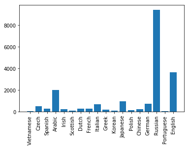
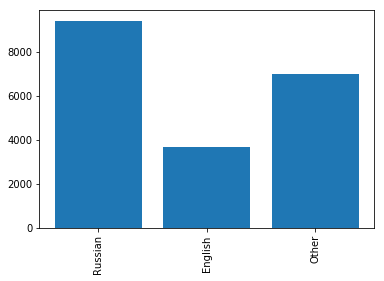
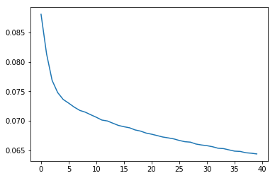

Implements simple character level name classification using Pytorch. Training is done using about 20K names across 18 languages. The names are clubbed into three categories : English, Russian, Other for simplicity. Using SGD as optimizer produces poor results, Adam performs better, Nadam even better.

Be careful of initializating the LSTM properly when using pytorch, unlike Keras, a proper initialization of the LSTM parameters is not automatically done for you.


```python
from __future__ import unicode_literals, print_function, division
from io import open
import glob
import os
import unicodedata
import string
import numpy as np
import torch
import torch.nn as nn
import random
import torch.optim as optim
import matplotlib.pyplot as plt
import matplotlib.ticker as ticker
import time
import math
```


```python
device = torch.device("cuda:0" if torch.cuda.is_available() else "cpu")
print(device)
```

```python
    cuda:0
```


```python
random.seed(30)
print(torch.__version__)
```

```python
    1.0.0a0
```


```python
def findFiles(path): 
    return glob.glob(path)

# Turn a Unicode string to plain ASCII, thanks to https://stackoverflow.com/a/518232/2809427
def unicodeToAscii(s):
    return ''.join(
        c for c in unicodedata.normalize('NFD', s)
        if unicodedata.category(c) != 'Mn'
        and c in all_chars
    )

# Read a file and split into lines
def readLines(filename):
    lines = open(filename, encoding='utf-8').read().strip().split('\n')
    return [unicodeToAscii(line) for line in lines]
```


```python
print('all training files=',findFiles('data/names/*.txt'))

pad_char = '#'
all_chars = string.ascii_letters + " .,;'" + pad_char
n_chars = len(all_chars)

print(unicodeToAscii('Ślusàrski'))

# Build the category_names dictionary, a list of names per language
category_names_dict = {}
all_categories = []

name_counts = []
for filename in findFiles('data/names/*.txt'):
    category = os.path.splitext(os.path.basename(filename))[0]
    all_categories.append(category)
    names = readLines(filename)
    category_names_dict[category] = names
    name_counts.append(len(names))

num_samples = np.sum(name_counts)
n_categories = len(all_categories)

print('Total ',num_samples,'names across',n_categories,'categories')
```

```python
    all training files= ['data/names/Vietnamese.txt', 'data/names/Czech.txt', 'data/names/Spanish.txt', 'data/names/Arabic.txt', 'data/names/Irish.txt', 'data/names/Scottish.txt', 'data/names/Dutch.txt', 'data/names/French.txt', 'data/names/Italian.txt', 'data/names/Greek.txt', 'data/names/Korean.txt', 'data/names/Japanese.txt', 'data/names/Polish.txt', 'data/names/Chinese.txt', 'data/names/German.txt', 'data/names/Russian.txt', 'data/names/Portuguese.txt', 'data/names/English.txt']
    Slusarski
    Total  20074 names across 18 categories
```


```python
print('No of characters, this is the encoding dimension of each character in a name : ',n_chars)
```

```python
    No of characters, this is the encoding dimension of each character in a name :  58
```


```python
print('all_categories=',all_categories,'\n')
print('category "English" has ',len(category_names_dict['English']),'names')
print(category_names_dict['English'][:5])
```

```python
    all_categories= ['Vietnamese', 'Czech', 'Spanish', 'Arabic', 'Irish', 'Scottish', 'Dutch', 'French', 'Italian', 'Greek', 'Korean', 'Japanese', 'Polish', 'Chinese', 'German', 'Russian', 'Portuguese', 'English'] 
    
    category "English" has  3668 names
    ['Abbas', 'Abbey', 'Abbott', 'Abdi', 'Abel']
```


```python
labels = list(category_names_dict.keys())
values = [len(names) for names in category_names_dict.values()]

plt.xticks(rotation=90)
centers = range(len(values))
plt.bar(centers, values, align='center', tick_label=labels)
plt.show()

for i,ll in enumerate(labels):
    print(ll,values[i])
```




```python
    Vietnamese 73
    Czech 519
    Spanish 298
    Arabic 2000
    Irish 232
    Scottish 100
    Dutch 297
    French 277
    Italian 709
    Greek 203
    Korean 94
    Japanese 991
    Polish 139
    Chinese 268
    German 724
    Russian 9408
    Portuguese 74
    English 3668
```


```python
category_names_dict['Other'] = []
to_skip = ['English','Russian','Other']
for k,v in category_names_dict.items():
    print('['+k,']',sep='')
    k = k.strip()
    if k not in to_skip:
        print(k)
        print(k is not 'English' and k is not 'Russian')
        print('Adding ',k,len(v))
        category_names_dict['Other'].extend(v)
        print(len(category_names_dict['Other']))
        print('---------------')
    else:
        print('skip')
        print('------------------')
        
category_names_dict = {i:category_names_dict[i] for i in category_names_dict if i in to_skip}

labels = list(category_names_dict.keys())
values = [len(names) for names in category_names_dict.values()]

plt.xticks(rotation=90)
centers = range(len(values))
plt.bar(centers, values, align='center', tick_label=labels)
plt.show()

for i,ll in enumerate(labels):
    print(ll,values[i])
    
all_categories = list(category_names_dict.keys())
n_categories = len(all_categories)
```

```python
    [Vietnamese]
    Vietnamese
    True
    Adding  Vietnamese 73
    73
    ---------------
    [Czech]
    Czech
    True
    Adding  Czech 519
    592
    ---------------
    [Spanish]
    Spanish
    True
    Adding  Spanish 298
    890
    ---------------
    [Arabic]
    Arabic
    True
    Adding  Arabic 2000
    2890
    ---------------
    [Irish]
    Irish
    True
    Adding  Irish 232
    3122
    ---------------
    [Scottish]
    Scottish
    True
    Adding  Scottish 100
    3222
    ---------------
    [Dutch]
    Dutch
    True
    Adding  Dutch 297
    3519
    ---------------
    [French]
    French
    True
    Adding  French 277
    3796
    ---------------
    [Italian]
    Italian
    True
    Adding  Italian 709
    4505
    ---------------
    [Greek]
    Greek
    True
    Adding  Greek 203
    4708
    ---------------
    [Korean]
    Korean
    True
    Adding  Korean 94
    4802
    ---------------
    [Japanese]
    Japanese
    True
    Adding  Japanese 991
    5793
    ---------------
    [Polish]
    Polish
    True
    Adding  Polish 139
    5932
    ---------------
    [Chinese]
    Chinese
    True
    Adding  Chinese 268
    6200
    ---------------
    [German]
    German
    True
    Adding  German 724
    6924
    ---------------
    [Russian]
    skip
    ------------------
    [Portuguese]
    Portuguese
    True
    Adding  Portuguese 74
    6998
    ---------------
    [English]
    skip
    ------------------
    [Other]
    skip
    ------------------
```




```python
    Russian 9408
    English 3668
    Other 6998
```


```python
print(all_categories)
print(n_categories)
```
```python
    ['Russian', 'English', 'Other']
    3
```


```python
# Find char index from all_chars, e.g. "a" = 0
def charToIndex(char):
    return all_chars.find(char)

# Just for demonstration, turn a char into a <1 x n_chars> Tensor
def charToTensor_one_hot(char):
    tensor = torch.zeros(1, n_chars)
    tensor[0][charToIndex(char)] = 1
    return tensor

def charToTensor(char):
    tensor = torch.zeros(1,dtype=torch.long)
    tensor[0] = charToIndex(char)
    return tensor

# Turn a line into a <line_length x 1 x n_chars>,
# or an array of one-hot char vectors
def seqToTensor_one_hot(seq):
    tensor = torch.zeros(len(seq),1, n_chars)
    for idx, char in enumerate(seq):
        tensor[idx][0][charToIndex(char)] = 1
    return tensor

def seqToTensor(seq):
    tensor = torch.zeros(len(seq), dtype=torch.long)
    for idx, char in enumerate(seq):
        tensor[idx] = int(charToIndex(char))
    return tensor


print('J=',charToTensor_one_hot('J').shape)

print('Jones=',seqToTensor_one_hot('Jones').size())

print(pad_char,charToTensor_one_hot(pad_char))
```

```python
    J= torch.Size([1, 58])
    Jones= torch.Size([5, 1, 58])
    # tensor([[0., 0., 0., 0., 0., 0., 0., 0., 0., 0., 0., 0., 0., 0., 0., 0., 0., 0.,
             0., 0., 0., 0., 0., 0., 0., 0., 0., 0., 0., 0., 0., 0., 0., 0., 0., 0.,
             0., 0., 0., 0., 0., 0., 0., 0., 0., 0., 0., 0., 0., 0., 0., 0., 0., 0.,
             0., 0., 0., 1.]])
```

## Batch data generator, batch is the first dimension


```python
def batch_data_generator(all_categories, category_names_dict, batch_size, n_chars, pad_char, shuffle):
    
    #flatten the dictionary to a list of tuples.
    dict_tuples = []
    for category,names in category_names_dict.items():
        for nm in names:
            dict_tuples.append((category,nm))
    
    num_samples = len(dict_tuples)
    num_batches = num_samples // batch_size
    
    print('batch_data_generator: num_samples =',num_samples,'num_batches = ',num_batches)
    
    epoch_num = 0
    
    while(True):
        
        if shuffle:
            random.shuffle(dict_tuples)
            random.shuffle(dict_tuples)
        indices = np.arange(num_samples)
        
        for batch_id in range(num_batches): #for each batch of names
            batch_indices = indices[batch_id * batch_size : (batch_id + 1) * batch_size]

            max_seqlen = 0 #max length of names in a batch.
            batch_names = []
            batch_labels = []
            batch_categories = []    
            name_tensors = []
            
            for b_ind in batch_indices:
                a_name = dict_tuples[b_ind][1]            #'Alex'
                category = dict_tuples[b_ind][0]          #'English'
                label = all_categories.index(category)    #17
                name_tensor = seqToTensor_one_hot(a_name)
                max_seqlen = name_tensor.shape[0] if name_tensor.shape[0] >= max_seqlen else max_seqlen
                batch_names.append(a_name)
                batch_labels.append(label)
                batch_categories.append(category)
                name_tensors.append(torch.squeeze(name_tensor))

            #for nt in name_tensors:    
            #    print('name_tensor=',nt.shape)
                
            #convert the batch list of tuples to tensors.
            #Put all the selected names into a single tensor for input to RNN
            
            pad_char_tensor = charToTensor_one_hot(pad_char) #tensor corresponding to pad_char
            
            batch_names_tensor = pad_char_tensor.repeat(batch_size, max_seqlen,1)
            
            #print('batch_names_tensor',batch_names_tensor.shape)
            
            for i,name_tensor in enumerate(name_tensors):
                num_chars = name_tensor.shape[0]
                #print(num_chars,'assigning',name_tensor.shape,'to',batch_names_tensor[i,0:num_chars,:].shape)
                batch_names_tensor[i,-num_chars:,:] = name_tensor #Left padding is done with pad_char
            
            batch_labels_tensor = torch.tensor(batch_labels,dtype=torch.long)
            
            batch_names_tensor = torch.squeeze(batch_names_tensor)
            
            yield(batch_categories, batch_names, batch_labels_tensor, batch_names_tensor,epoch_num)
            
        #done looping through all batches.
        #go to the top and permute the file indices.
        epoch_num += 1
        
        
def categoryFromOutput(an_output):
    top_n, top_i = an_output.topk(1)
    category_i = top_i[0].item()
    return all_categories[category_i], category_i
```

## Simple LSTM 
### Note how the biases and weights are initialized using xavier normal initializer, this is important for LSTM to train properly


```python
class SimpleLSTM(nn.Module):

    def __init__(self, input_size, output_size, hidden_dim=10, printVars=False):
        super().__init__()
        self.hidden_dim = hidden_dim
        lstm_hidden_dim = hidden_dim
        self.lstm = nn.LSTM(input_size, lstm_hidden_dim, bidirectional=False, batch_first=True)
        
        self.hidden2tag = nn.Linear(hidden_dim, output_size)
        #dim=2 as we are doing softmax across the last dimension of output_size
        self.softmax = nn.Softmax(dim=2)
        
        self.hidden = None
        self.printVars = printVars #run the print statements in forward ?
        
        #initialize biases and weights
        for name, param in self.named_parameters():
            if 'bias' in name:
                nn.init.constant(param, 0.0)
            elif 'weight' in name:
                nn.init.xavier_normal(param)
                
                

    def init_hidden(self, batch_size):
        
        lstm_hidden_dim = self.hidden_dim
        
        #h_0 = torch.randn(1, batch_size, lstm_hidden_dim)        
        #c_0 = torch.randn(1, batch_size, lstm_hidden_dim)
        
        weight = next(self.parameters()).data
        h_0 = weight.new(1, batch_size, lstm_hidden_dim).zero_()
        c_0 = weight.new(1, batch_size, lstm_hidden_dim).zero_()
        
        return (h_0,c_0)


    def forward(self, batch_of_words):
        
        batch_size = batch_of_words.shape[0]
        
        #This is stateless LSTM, so hidden and cell states are initialized for every forward pass.
        #The hidden and cell states are not preserved across batches.
        self.hidden = self.init_hidden(batch_size)
        
        h_0 = self.hidden[0] #initial hidden state, shape (num_direction*num_layers , batch_size, hidden_dim)
        c_0 = self.hidden[1] #initial cell state, shape (num_direction*num_layers , batch_size, hidden_dim)
        
        if self.printVars:
            print('forward: h_0.shape',h_0.shape)
            print('forward: c_0.shape',c_0.shape)
            print()
        
        x = batch_of_words
        
        output, self.hidden = self.lstm(x, self.hidden)
        
        h_n = self.hidden[0] # hidden state for t = seq_len.
        c_n = self.hidden[1] # cell state for t = seq_len.
        
        if self.printVars:
            print('forward: lstm output = ',output.shape)
            print('forward: h_n = ',h_n.shape)
            print('forward: c_n = ',c_n.shape)
        
        #LSTM output : 
        output1 = self.hidden2tag(output) #make the lstm_output go through a linear layer
        
        if self.printVars:
            print('o/p of hidden2tag\n')
            print(output1.shape)
            print(output1)
        
        final_output = self.softmax(output1)
        
        if self.printVars:
            print('forward: final_output = ',final_output.shape)
            
        return final_output

```

### Feeding one batch of characters (a single position of a batch of names) to the RNN 


```python
n_hidden = 4
batch_size = 5
shuffle = True

batch_generator = batch_data_generator(all_categories, category_names_dict, batch_size, n_chars, pad_char, shuffle)
```


```python
print('Number of name categories, this is the no. of output categories = ',n_categories)
```

```python
    Number of name categories, this is the no. of output categories =  3
```


```python
batch_categories, batch_names, batch_labels_tensor, batch_names_tensor, epoch_num = next(batch_generator)

print('Batch contents:')
for i in range(batch_size):
    print('category:',batch_categories[i],', name:',batch_names[i])
print()
    
print('Full input tensor shape = ',batch_names_tensor.shape)

print('input_tensor =',batch_names_tensor.shape)

print('batch_size=',batch_names_tensor.shape[0])
print('seq_len=',batch_names_tensor.shape[1])
print('n_chars=',n_chars)
```

    batch_data_generator: num_samples = 20074 num_batches =  4014
    Batch contents:
    category: Russian , name: Beloshapka
    category: Other , name: Schreck
    category: English , name: May
    category: Other , name: Collins
    category: English , name: Bishop
    
    Full input tensor shape =  torch.Size([5, 10, 58])
    input_tensor = torch.Size([5, 10, 58])
    batch_size= 5
    seq_len= 10
    n_chars= 58


### Just run a forward pass of the batch through LSTM to see how the output looks like. 


```python
lstm_rnn = SimpleLSTM(n_chars, n_categories, hidden_dim=n_hidden,printVars = False) 
        
batch_categories, batch_names, batch_labels_tensor, batch_names_tensor, epoch_num = next(batch_generator)


print('Batch contents:')
for i in range(batch_size):
    print('category:',batch_categories[i],', name:',batch_names[i])
print()
    
print('Full input tensor shape = ',batch_names_tensor.shape)

print('input_tensor =',batch_names_tensor.shape)
emissions = lstm_rnn(batch_names_tensor)

print('Full op\n')
print(emissions)
criterion = nn.NLLLoss()
output = emissions[:,-1] #take the output from the last LSTM cell (last timestep) for predictions.

print(output.shape)
print('output=\n',output)

for op in output:
    guess, guess_i = categoryFromOutput(op)
    print(guess,guess_i)
```

```python
    Batch contents:
    category: Russian , name: Tzarenko
    category: Other , name: Thach
    category: English , name: Kingdon
    category: English , name: Oldfield
    category: Other , name: Albuquerque
    
    Full input tensor shape =  torch.Size([5, 11, 58])
    input_tensor = torch.Size([5, 11, 58])
    Full op
    
    tensor([[[0.3482, 0.3360, 0.3158],
             [0.3548, 0.3373, 0.3079],
             [0.3577, 0.3379, 0.3043],
             [0.3362, 0.3349, 0.3289],
             [0.3269, 0.3291, 0.3440],
             [0.3336, 0.3390, 0.3274],
             [0.3416, 0.3292, 0.3292],
             [0.3293, 0.3420, 0.3287],
             [0.3221, 0.3349, 0.3430],
             [0.3257, 0.3375, 0.3369],
             [0.3241, 0.3361, 0.3398]],
    
            [[0.3482, 0.3360, 0.3158],
             [0.3548, 0.3373, 0.3079],
             [0.3577, 0.3379, 0.3043],
             [0.3591, 0.3383, 0.3027],
             [0.3597, 0.3384, 0.3019],
             [0.3600, 0.3385, 0.3015],
             [0.3372, 0.3353, 0.3275],
             [0.3341, 0.3381, 0.3278],
             [0.3353, 0.3431, 0.3215],
             [0.3218, 0.3173, 0.3609],
             [0.3334, 0.3339, 0.3326]],
    
            [[0.3482, 0.3360, 0.3158],
             [0.3548, 0.3373, 0.3079],
             [0.3577, 0.3379, 0.3043],
             [0.3591, 0.3383, 0.3027],
             [0.3466, 0.3436, 0.3098],
             [0.3492, 0.3559, 0.2949],
             [0.3308, 0.3437, 0.3255],
             [0.3315, 0.3316, 0.3369],
             [0.3202, 0.3437, 0.3362],
             [0.3219, 0.3396, 0.3385],
             [0.3206, 0.3355, 0.3439]],
    
            [[0.3482, 0.3360, 0.3158],
             [0.3548, 0.3373, 0.3079],
             [0.3577, 0.3379, 0.3043],
             [0.3457, 0.3451, 0.3092],
             [0.3324, 0.3513, 0.3163],
             [0.3197, 0.3510, 0.3292],
             [0.3149, 0.3380, 0.3471],
             [0.3381, 0.3527, 0.3092],
             [0.3301, 0.3532, 0.3167],
             [0.3273, 0.3555, 0.3172],
             [0.3183, 0.3528, 0.3289]],
    
            [[0.3350, 0.3494, 0.3156],
             [0.3297, 0.3533, 0.3170],
             [0.3262, 0.3377, 0.3362],
             [0.3521, 0.3521, 0.2957],
             [0.3392, 0.3634, 0.2974],
             [0.3562, 0.3582, 0.2856],
             [0.3356, 0.3573, 0.3071],
             [0.3438, 0.3387, 0.3175],
             [0.3340, 0.3522, 0.3138],
             [0.3522, 0.3520, 0.2958],
             [0.3336, 0.3538, 0.3126]]], grad_fn=<SoftmaxBackward>)
    torch.Size([5, 3])
    output=
     tensor([[0.3241, 0.3361, 0.3398],
            [0.3334, 0.3339, 0.3326],
            [0.3206, 0.3355, 0.3439],
            [0.3183, 0.3528, 0.3289],
            [0.3336, 0.3538, 0.3126]], grad_fn=<SelectBackward>)
    Other 2
    English 1
    Other 2
    English 1
    English 1


    /opt/conda/lib/python3.6/site-packages/ipykernel_launcher.py:18: UserWarning: nn.init.xavier_normal is now deprecated in favor of nn.init.xavier_normal_.
    /opt/conda/lib/python3.6/site-packages/ipykernel_launcher.py:16: UserWarning: nn.init.constant is now deprecated in favor of nn.init.constant_.
      app.launch_new_instance()
```

### Define the training parameters


```python
batch_size = 10
n_hidden = 128
learning_rate = 0.0001

shuffle = True #for training

#rnn = RNN(n_chars, n_hidden, n_categories)
lstm_rnn = SimpleLSTM(n_chars, n_categories, hidden_dim=n_hidden, printVars=False)

#criterion = nn.NLLLoss()
criterion = nn.CrossEntropyLoss()


#optimizer = optim.SGD(lstm_rnn.parameters(), lr=learning_rate)
optimizer = optim.Adam(lstm_rnn.parameters(), lr=learning_rate)

batch_generator = batch_data_generator(all_categories, category_names_dict, batch_size, n_chars, pad_char, shuffle)
```

    /opt/conda/lib/python3.6/site-packages/ipykernel_launcher.py:18: UserWarning: nn.init.xavier_normal is now deprecated in favor of nn.init.xavier_normal_.
    /opt/conda/lib/python3.6/site-packages/ipykernel_launcher.py:16: UserWarning: nn.init.constant is now deprecated in favor of nn.init.constant_.
      app.launch_new_instance()


### Define function to train : one step of training using one batch of inputs


```python
def train(rnn, category_tensor, all_names_tensor,batch_size):
    
    #hidden = rnn.init_hidden(batch_size) #don't need, already called in forward of lstm.

    rnn.zero_grad()

    output = rnn(all_names_tensor)[:,-1]
    #print(category_tensor)
    loss = criterion(output, category_tensor)
    loss.backward()

    # Manual parameter updates : this also works
    # Add parameters' gradients to their values, multiplied by learning rate
    #for p in rnn.parameters():
    #    p.data.add_(p.grad.data, alpha=-learning_rate)
    
    clip = 5
    #nn.utils.clip_grad_norm_(rnn.parameters(), clip)
    optimizer.step()

    return output, loss, loss.item()/batch_size
```

### Training 


```python
n_iters = 200000
print_every = 10000
plot_every = 5000

# Keep track of losses for plotting
current_loss = 0
all_losses = []

def timeSince(since):
    now = time.time()
    s = now - since
    m = math.floor(s / 60)
    s -= m * 60
    return '%dm %ds' % (m, s)

start = time.time()

curr_epoch = 0

for iter in range(1, n_iters + 1):
                                                                                
    batch_categories, batch_names, batch_labels_tensor, batch_names_tensor, epoch_num = next(batch_generator)
    output_batch, loss_tensor, loss = train(lstm_rnn, batch_labels_tensor, batch_names_tensor,batch_size)
    current_loss += loss

    # Print iter number, loss, name and guess
    if (iter % print_every == 0) or (curr_epoch!=epoch_num) :
        print('epoch=',curr_epoch)
        ii = 0
        for op in output_batch:
            guess, guess_i = categoryFromOutput(op)
            correct = '✓' if guess == batch_categories[ii] else '✗ (%s)' % batch_categories[ii]
            print('%d %d%% (%s) %.4f %s / %s %s' % (iter, iter / n_iters * 100, timeSince(start), 
                                                    loss, batch_names[ii], guess, correct))
            ii += 1
        print('---------------------------------------------------------------------------------')
            
    # Add current loss avg to list of losses
    if iter % plot_every == 0:
        all_losses.append(current_loss / plot_every)
        print('current_loss=',current_loss/plot_every)
        current_loss = 0    
        
    curr_epoch = epoch_num
```

### Training output

```python
    batch_data_generator: num_samples = 20074 num_batches =  2007
    epoch= 0
    2008 1% (0m 21s) 0.1042 Ibarra / Other ✓
    2008 1% (0m 21s) 0.1042 Fiskin / Russian ✓
    2008 1% (0m 21s) 0.1042 Parks / Other ✗ (English)
    2008 1% (0m 21s) 0.1042 Almasi / Other ✓
    2008 1% (0m 21s) 0.1042 Riches / Other ✗ (English)
    2008 1% (0m 21s) 0.1042 Oloughlin / Russian ✗ (English)
    2008 1% (0m 21s) 0.1042 Rahlin / Russian ✓
    2008 1% (0m 21s) 0.1042 Vyschipan / Russian ✓
    2008 1% (0m 21s) 0.1042 Cook / Other ✗ (English)
    2008 1% (0m 21s) 0.1042 Murphy / Other ✓
    ---------------------------------------------------------------------------------
    epoch= 1
    4015 2% (0m 45s) 0.0795 Shahnovich / Russian ✓
    4015 2% (0m 45s) 0.0795 Lohanin / Russian ✓
    4015 2% (0m 45s) 0.0795 Boutros / Other ✓
    4015 2% (0m 45s) 0.0795 Samuel / Other ✓
    4015 2% (0m 45s) 0.0795 Losa / Other ✓
    4015 2% (0m 45s) 0.0795 Clayton / Russian ✗ (English)
    4015 2% (0m 45s) 0.0795 Roijakkers / Other ✓
    4015 2% (0m 45s) 0.0795 Hairyuzov / Russian ✓
    4015 2% (0m 45s) 0.0795 Macdonald / Other ✗ (English)
    4015 2% (0m 45s) 0.0795 Marutenkov / Russian ✓
    ---------------------------------------------------------------------------------
    current_loss= 0.08807812912225668
    epoch= 2
    6022 3% (1m 8s) 0.0704 Kase / Other ✓
    6022 3% (1m 8s) 0.0704 Denton / Russian ✗ (English)
    6022 3% (1m 8s) 0.0704 Daher / Other ✓
    6022 3% (1m 8s) 0.0704 Djanakavov / Russian ✓
    6022 3% (1m 8s) 0.0704 Poyarkov / Russian ✓
    6022 3% (1m 8s) 0.0704 Yagofarov / Russian ✓
    6022 3% (1m 8s) 0.0704 Shalhoub / Other ✓
    6022 3% (1m 8s) 0.0704 Mizumaki / Other ✓
    6022 3% (1m 8s) 0.0704 Bosch / Other ✓
    6022 3% (1m 8s) 0.0704 Bagishaev / Russian ✓
    ---------------------------------------------------------------------------------
    epoch= 3
    8029 4% (1m 23s) 0.0939 Mackie / Other ✗ (English)
    8029 4% (1m 23s) 0.0939 Lihodei / Other ✗ (Russian)
    8029 4% (1m 23s) 0.0939 Tchanov / Russian ✓
    8029 4% (1m 23s) 0.0939 Groer / Other ✗ (Russian)
    8029 4% (1m 23s) 0.0939 Mcnulty / Other ✗ (English)
    8029 4% (1m 23s) 0.0939 Baklanoff / Russian ✓
    8029 4% (1m 23s) 0.0939 Chertok / Other ✗ (Russian)
    8029 4% (1m 23s) 0.0939 Ryjanov / Russian ✓
    8029 4% (1m 23s) 0.0939 Fearon / Other ✗ (English)
    8029 4% (1m 23s) 0.0939 Dobryakov / Russian ✓
    ---------------------------------------------------------------------------------
    epoch= 4
    10000 5% (1m 44s) 0.0958 Pickard / Other ✗ (English)
    10000 5% (1m 44s) 0.0958 Zouvelekis / Russian ✗ (Other)
    10000 5% (1m 44s) 0.0958 Yarwood / Other ✗ (English)
    10000 5% (1m 44s) 0.0958 Cowie / Other ✗ (English)
    10000 5% (1m 44s) 0.0958 Noon / Other ✗ (English)
    10000 5% (1m 44s) 0.0958 Kikuchi / Other ✓
    10000 5% (1m 44s) 0.0958 Yakunkin / Russian ✓
    10000 5% (1m 44s) 0.0958 Tchalykh / Russian ✓
    10000 5% (1m 44s) 0.0958 Oswald / Other ✗ (English)
    10000 5% (1m 44s) 0.0958 Nave / Other ✓
    ---------------------------------------------------------------------------------
    current_loss= 0.08134208572387697
    epoch= 4
    10036 5% (1m 45s) 0.0687 Bakhmatoff / Russian ✓
    10036 5% (1m 45s) 0.0687 Rompaeij / Other ✓
    10036 5% (1m 45s) 0.0687 Holyuchenko / Russian ✓
    10036 5% (1m 45s) 0.0687 Nascimbeni / Other ✓
    10036 5% (1m 45s) 0.0687 Ferns / Other ✗ (English)
    10036 5% (1m 45s) 0.0687 Atlantov / Russian ✓
    10036 5% (1m 45s) 0.0687 Nader / Other ✓
    10036 5% (1m 45s) 0.0687 Yankevich / Russian ✓
    10036 5% (1m 45s) 0.0687 Jivokini / Russian ✓
    10036 5% (1m 45s) 0.0687 Belman / English ✗ (Russian)
    ---------------------------------------------------------------------------------
    epoch= 5
    12043 6% (2m 7s) 0.1054 Batura / Other ✗ (Russian)
    12043 6% (2m 7s) 0.1054 Tcheklyanov / Russian ✓
    12043 6% (2m 7s) 0.1054 Tsipushtanov / Russian ✓
    12043 6% (2m 7s) 0.1054 Vedyashkin / Russian ✓
    12043 6% (2m 7s) 0.1054 Voclain / Russian ✗ (Other)
    12043 6% (2m 7s) 0.1054 Mochalin / Russian ✓
    12043 6% (2m 7s) 0.1054 Isa / Other ✓
    12043 6% (2m 7s) 0.1054 Kennard / Other ✗ (English)
    12043 6% (2m 7s) 0.1054 Burns / Other ✗ (English)
    12043 6% (2m 7s) 0.1054 Novy Novy / Russian ✗ (Other)
    ---------------------------------------------------------------------------------
    epoch= 6
    14050 7% (2m 31s) 0.0735 Helimsky / Russian ✓
    14050 7% (2m 31s) 0.0735 Matsuzawa / Other ✓
    14050 7% (2m 31s) 0.0735 Escarcega / Other ✓
    14050 7% (2m 31s) 0.0735 Rekunkov / Russian ✓
    14050 7% (2m 31s) 0.0735 Bibitinsky / Russian ✓
    14050 7% (2m 31s) 0.0735 Jevlakov / Russian ✓
    14050 7% (2m 31s) 0.0735 Pecora / Other ✓
    14050 7% (2m 31s) 0.0735 Yuhma / Other ✗ (Russian)
    14050 7% (2m 31s) 0.0735 Uhanov / Russian ✓
    14050 7% (2m 31s) 0.0735 Booth / Other ✗ (English)
    ---------------------------------------------------------------------------------
    current_loss= 0.07685049535870557
    epoch= 7
    16057 8% (2m 56s) 0.0744 Koury / Other ✓
    16057 8% (2m 56s) 0.0744 Bandoni / Other ✓
    16057 8% (2m 56s) 0.0744 Sabbag / Other ✓
    16057 8% (2m 56s) 0.0744 Traversa / Other ✓
    16057 8% (2m 56s) 0.0744 Hope / Other ✗ (English)
    16057 8% (2m 56s) 0.0744 Patselas / Other ✓
    16057 8% (2m 56s) 0.0744 Sakun / Other ✗ (Russian)
    16057 8% (2m 56s) 0.0744 Maryushkin / Russian ✓
    16057 8% (2m 56s) 0.0744 Merritt / English ✓
    16057 8% (2m 56s) 0.0744 Jeltukhin / Russian ✓
    ---------------------------------------------------------------------------------
    epoch= 8
    18064 9% (3m 18s) 0.0673 Tsidilin / Russian ✓
    18064 9% (3m 18s) 0.0673 Egorkin / Russian ✓
    18064 9% (3m 18s) 0.0673 Grulich / English ✗ (Other)
    18064 9% (3m 18s) 0.0673 Zhurov / Russian ✓
    18064 9% (3m 18s) 0.0673 Levesque / Other ✓
    18064 9% (3m 18s) 0.0673 Shadid / Other ✓
    18064 9% (3m 18s) 0.0673 Linsby / English ✓
    18064 9% (3m 18s) 0.0673 Jukhanaev / Russian ✓
    18064 9% (3m 18s) 0.0673 Yakovlev / Russian ✓
    18064 9% (3m 18s) 0.0673 Fukusaku / Other ✓
    ---------------------------------------------------------------------------------
    epoch= 9
    20000 10% (3m 39s) 0.0800 Deans / Other ✗ (English)
    20000 10% (3m 39s) 0.0800 Mochalov / Russian ✓
    20000 10% (3m 39s) 0.0800 Fionov / Russian ✓
    20000 10% (3m 39s) 0.0800 Knutt / Other ✗ (English)
    20000 10% (3m 39s) 0.0800 Batsura / Other ✗ (Russian)
    20000 10% (3m 39s) 0.0800 Janishevsky / Russian ✓
    20000 10% (3m 39s) 0.0800 Zhimila / Russian ✓
    20000 10% (3m 39s) 0.0800 Nishiwaki / Other ✓
    20000 10% (3m 39s) 0.0800 Abalkin / Russian ✓
    20000 10% (3m 39s) 0.0800 Pochevalov / Russian ✓
    ---------------------------------------------------------------------------------
    current_loss= 0.07478637581110009
    epoch= 9
    20071 10% (3m 40s) 0.0665 Dudley / English ✓
    20071 10% (3m 40s) 0.0665 Aldana / Other ✓
    20071 10% (3m 40s) 0.0665 Lejankov / Russian ✓
    20071 10% (3m 40s) 0.0665 Halilulin / Russian ✓
    20071 10% (3m 40s) 0.0665 Mifsud / Other ✓
    20071 10% (3m 40s) 0.0665 Shalashov / Russian ✓
    20071 10% (3m 40s) 0.0665 Bektabegov / Russian ✓
    20071 10% (3m 40s) 0.0665 Abdrakhmanoff / Russian ✓
    20071 10% (3m 40s) 0.0665 Vlasak / Russian ✗ (Other)
    20071 10% (3m 40s) 0.0665 Girard / Other ✓
    ---------------------------------------------------------------------------------
    epoch= 10
    22078 11% (4m 7s) 0.0584 Thelwell / English ✓
    22078 11% (4m 7s) 0.0584 Levichev / Russian ✓
    22078 11% (4m 7s) 0.0584 Truscott / English ✓
    22078 11% (4m 7s) 0.0584 Bata / Other ✓
    22078 11% (4m 7s) 0.0584 Tahan / Other ✓
    22078 11% (4m 7s) 0.0584 Little / English ✓
    22078 11% (4m 7s) 0.0584 Madeira / Other ✓
    22078 11% (4m 7s) 0.0584 Kalb / Other ✓
    22078 11% (4m 7s) 0.0584 Caplan / English ✓
    22078 11% (4m 7s) 0.0584 Shamoun / Other ✓
    ---------------------------------------------------------------------------------
    epoch= 11
    24085 12% (4m 22s) 0.0674 Cutts / English ✓
    24085 12% (4m 22s) 0.0674 Thornes / English ✓
    24085 12% (4m 22s) 0.0674 Jerdev / Russian ✓
    24085 12% (4m 22s) 0.0674 Vakichev / Russian ✓
    24085 12% (4m 22s) 0.0674 Lagorio / Other ✓
    24085 12% (4m 22s) 0.0674 Almasi / Other ✓
    24085 12% (4m 22s) 0.0674 Efanov / Russian ✓
    24085 12% (4m 22s) 0.0674 Overall / Other ✗ (English)
    24085 12% (4m 22s) 0.0674 Lu / Other ✓
    24085 12% (4m 22s) 0.0674 Awertcheff / Russian ✓
    ---------------------------------------------------------------------------------
    current_loss= 0.0736081488990784
    epoch= 12
    26092 13% (4m 34s) 0.0563 Morekhin / Russian ✓
    26092 13% (4m 34s) 0.0563 Jablochkin / Russian ✓
    26092 13% (4m 34s) 0.0563 Valyavski / Russian ✓
    26092 13% (4m 34s) 0.0563 Tihonov / Russian ✓
    26092 13% (4m 34s) 0.0563 Bertsimas / Other ✓
    26092 13% (4m 34s) 0.0563 Vyborov / Russian ✓
    26092 13% (4m 34s) 0.0563 Mukke / Russian ✓
    26092 13% (4m 34s) 0.0563 Paterson / English ✓
    26092 13% (4m 34s) 0.0563 Isbitt / English ✓
    26092 13% (4m 34s) 0.0563 Easton / English ✓
    ---------------------------------------------------------------------------------
    epoch= 13
    28099 14% (4m 59s) 0.0583 Stanton / English ✓
    28099 14% (4m 59s) 0.0583 Rafaj / Other ✓
    28099 14% (4m 59s) 0.0583 Ilett / English ✓
    28099 14% (4m 59s) 0.0583 Frary / English ✓
    28099 14% (4m 59s) 0.0583 V'Yunkov / Russian ✓
    28099 14% (4m 59s) 0.0583 Valk / Russian ✓
    28099 14% (4m 59s) 0.0583 Doherty / English ✓
    28099 14% (4m 59s) 0.0583 Baigulov / Russian ✓
    28099 14% (4m 59s) 0.0583 Jmudsky / Russian ✓
    28099 14% (4m 59s) 0.0583 Chukhrov / Russian ✓
    ---------------------------------------------------------------------------------
    epoch= 14
    30000 15% (5m 17s) 0.0781 Burt / Other ✗ (English)
    30000 15% (5m 17s) 0.0781 Rotin / English ✗ (Russian)
    30000 15% (5m 17s) 0.0781 Belokhin / Russian ✓
    30000 15% (5m 17s) 0.0781 Haradurov / Russian ✓
    30000 15% (5m 17s) 0.0781 Man / Other ✓
    30000 15% (5m 17s) 0.0781 Jandutkin / Russian ✓
    30000 15% (5m 17s) 0.0781 Tzeidler / Other ✗ (Russian)
    30000 15% (5m 17s) 0.0781 V'Yunov / Russian ✓
    30000 15% (5m 17s) 0.0781 Lupov / Russian ✓
    30000 15% (5m 17s) 0.0781 Bakoff / Russian ✓
    ---------------------------------------------------------------------------------
    current_loss= 0.07297956034898752
    epoch= 14
    30106 15% (5m 18s) 0.0709 Hazbulatov / Russian ✓
    30106 15% (5m 18s) 0.0709 Judahin / Russian ✓
    30106 15% (5m 18s) 0.0709 Isaichev / Russian ✓
    30106 15% (5m 18s) 0.0709 Desrosiers / Other ✓
    30106 15% (5m 18s) 0.0709 Martinenas / Other ✗ (Russian)
    30106 15% (5m 18s) 0.0709 Hoyle / English ✓
    30106 15% (5m 18s) 0.0709 Zimarin / Russian ✓
    30106 15% (5m 18s) 0.0709 Kanaan / Other ✓
    30106 15% (5m 18s) 0.0709 Wolf / English ✗ (Other)
    30106 15% (5m 18s) 0.0709 Tchekonov / Russian ✓
    ---------------------------------------------------------------------------------
    epoch= 15
    32113 16% (5m 40s) 0.0895 Sawamura / Other ✓
    32113 16% (5m 40s) 0.0895 Ta / Other ✓
    32113 16% (5m 40s) 0.0895 Gerhard / Other ✓
    32113 16% (5m 40s) 0.0895 Noach / Other ✗ (English)
    32113 16% (5m 40s) 0.0895 Bartalotti / Other ✓
    32113 16% (5m 40s) 0.0895 Goode / Other ✗ (English)
    32113 16% (5m 40s) 0.0895 Davidson / Russian ✗ (English)
    32113 16% (5m 40s) 0.0895 Abjalilov / Russian ✓
    32113 16% (5m 40s) 0.0895 Hafernik / Russian ✗ (Other)
    32113 16% (5m 40s) 0.0895 Avtomovich / Russian ✓
    ---------------------------------------------------------------------------------
    epoch= 16
    34120 17% (5m 53s) 0.0669 Wolff / English ✗ (Other)
    34120 17% (5m 53s) 0.0669 Totah / Other ✓
    34120 17% (5m 53s) 0.0669 Baklund / Russian ✓
    34120 17% (5m 53s) 0.0669 Appleby / English ✓
    34120 17% (5m 53s) 0.0669 Blackwell / English ✓
    34120 17% (5m 53s) 0.0669 Masih / Other ✓
    34120 17% (5m 53s) 0.0669 Nana / Other ✓
    34120 17% (5m 53s) 0.0669 Anikin / Russian ✓
    34120 17% (5m 53s) 0.0669 Totah / Other ✓
    34120 17% (5m 53s) 0.0669 Palladino / Other ✓
    ---------------------------------------------------------------------------------
    current_loss= 0.07230451519012449
    epoch= 17
    36127 18% (6m 19s) 0.0589 Muladjanov / Russian ✓
    36127 18% (6m 19s) 0.0589 Valyavski / Russian ✓
    36127 18% (6m 19s) 0.0589 Tempest / English ✓
    36127 18% (6m 19s) 0.0589 Tsekhanovich / Russian ✓
    36127 18% (6m 19s) 0.0589 Swanson / English ✓
    36127 18% (6m 19s) 0.0589 Zhuo / Other ✓
    36127 18% (6m 19s) 0.0589 Yun / Other ✓
    36127 18% (6m 19s) 0.0589 Onishi / Other ✓
    36127 18% (6m 19s) 0.0589 Naser / Other ✓
    36127 18% (6m 19s) 0.0589 Abaziev / Russian ✓
    ---------------------------------------------------------------------------------
    epoch= 18
    38134 19% (6m 41s) 0.0719 Patsev / Russian ✓
    38134 19% (6m 41s) 0.0719 Quirke / Other ✓
    38134 19% (6m 41s) 0.0719 Plichko / Russian ✓
    38134 19% (6m 41s) 0.0719 Gribkov / Russian ✓
    38134 19% (6m 41s) 0.0719 Schepatov / Russian ✓
    38134 19% (6m 41s) 0.0719 Jimila / Russian ✓
    38134 19% (6m 41s) 0.0719 Gaudin / Russian ✗ (English)
    38134 19% (6m 41s) 0.0719 Isgate / English ✓
    38134 19% (6m 41s) 0.0719 Abrosimoff / Russian ✓
    38134 19% (6m 41s) 0.0719 Arian / Other ✓
    ---------------------------------------------------------------------------------
    epoch= 19
    40000 20% (7m 2s) 0.0751 Juhtanov / Russian ✓
    40000 20% (7m 2s) 0.0751 Vilonov / Russian ✓
    40000 20% (7m 2s) 0.0751 Jadrihinsky / Russian ✓
    40000 20% (7m 2s) 0.0751 Hanzhonkov / Russian ✓
    40000 20% (7m 2s) 0.0751 Galkin / Russian ✓
    40000 20% (7m 2s) 0.0751 Nicolson / English ✓
    40000 20% (7m 2s) 0.0751 Tuporshin / Russian ✓
    40000 20% (7m 2s) 0.0751 Niemczyk / Russian ✗ (Other)
    40000 20% (7m 2s) 0.0751 Boutros / Other ✓
    40000 20% (7m 2s) 0.0751 Hait / Other ✗ (Russian)
    ---------------------------------------------------------------------------------
    current_loss= 0.07174799276828771
    epoch= 19
    40141 20% (7m 3s) 0.0815 Kawate / Other ✓
    40141 20% (7m 3s) 0.0815 Hike / Russian ✗ (Other)
    40141 20% (7m 3s) 0.0815 Zinevich / Russian ✓
    40141 20% (7m 3s) 0.0815 Maloof / Other ✓
    40141 20% (7m 3s) 0.0815 Gulentsov / Russian ✓
    40141 20% (7m 3s) 0.0815 Shirko / Other ✗ (Russian)
    40141 20% (7m 3s) 0.0815 Kilminster / Other ✗ (English)
    40141 20% (7m 3s) 0.0815 Gutteridge / English ✓
    40141 20% (7m 3s) 0.0815 Liberman / Russian ✓
    40141 20% (7m 3s) 0.0815 Shakhmagon / Russian ✓
    ---------------------------------------------------------------------------------
    epoch= 20
    42148 21% (7m 25s) 0.0727 Fox / Other ✗ (English)
    42148 21% (7m 25s) 0.0727 Isa / Other ✓
    42148 21% (7m 25s) 0.0727 Jian / Russian ✗ (Other)
    42148 21% (7m 25s) 0.0727 Nobunaga / Other ✓
    42148 21% (7m 25s) 0.0727 Meisner / Other ✓
    42148 21% (7m 25s) 0.0727 Babakhanov / Russian ✓
    42148 21% (7m 25s) 0.0727 Tokuoka / Other ✓
    42148 21% (7m 25s) 0.0727 Shananykin / Russian ✓
    42148 21% (7m 25s) 0.0727 Oxley / English ✓
    42148 21% (7m 25s) 0.0727 Zhimulev / Russian ✓
    ---------------------------------------------------------------------------------
    epoch= 21
    44155 22% (7m 54s) 0.0676 Baz / Other ✓
    44155 22% (7m 54s) 0.0676 Chernovisov / Russian ✓
    44155 22% (7m 54s) 0.0676 Assaf / Other ✓
    44155 22% (7m 54s) 0.0676 Bai / Other ✓
    44155 22% (7m 54s) 0.0676 Bazovsky / Russian ✓
    44155 22% (7m 54s) 0.0676 Atyashev / Russian ✓
    44155 22% (7m 54s) 0.0676 Parris / Other ✓
    44155 22% (7m 54s) 0.0676 Boulton / English ✓
    44155 22% (7m 54s) 0.0676 Reinders / English ✗ (Other)
    44155 22% (7m 54s) 0.0676 Lloyd / English ✓
    ---------------------------------------------------------------------------------
    current_loss= 0.07144598689675355
    epoch= 22
    46162 23% (8m 16s) 0.0693 Trujillo / Russian ✗ (Other)
    46162 23% (8m 16s) 0.0693 Barabashev / Russian ✓
    46162 23% (8m 16s) 0.0693 Close / English ✗ (Other)
    46162 23% (8m 16s) 0.0693 Stoddart / English ✓
    46162 23% (8m 16s) 0.0693 Gladkih / Russian ✓
    46162 23% (8m 16s) 0.0693 Kilroy / English ✓
    46162 23% (8m 16s) 0.0693 Sabbag / Other ✓
    46162 23% (8m 16s) 0.0693 Bagretsov / Russian ✓
    46162 23% (8m 16s) 0.0693 Mas / Other ✓
    46162 23% (8m 16s) 0.0693 Kwang  / Other ✓
    ---------------------------------------------------------------------------------
    epoch= 23
    48169 24% (8m 38s) 0.0682 Zinyuhin / Russian ✓
    48169 24% (8m 38s) 0.0682 Rotermel / English ✗ (Russian)
    48169 24% (8m 38s) 0.0682 Tchekis / Russian ✓
    48169 24% (8m 38s) 0.0682 Solberg / Other ✓
    48169 24% (8m 38s) 0.0682 Maksyutenko / Russian ✓
    48169 24% (8m 38s) 0.0682 Slaski / Other ✓
    48169 24% (8m 38s) 0.0682 Radley / English ✓
    48169 24% (8m 38s) 0.0682 Shakhlevich / Russian ✓
    48169 24% (8m 38s) 0.0682 Pytalev / Russian ✓
    48169 24% (8m 38s) 0.0682 Acquarone / Other ✓
    ---------------------------------------------------------------------------------
    epoch= 24
    50000 25% (8m 58s) 0.0638 Maroun / Other ✓
    50000 25% (8m 58s) 0.0638 Morjin / Russian ✓
    50000 25% (8m 58s) 0.0638 Holding / English ✓
    50000 25% (8m 58s) 0.0638 Ukhin / Russian ✓
    50000 25% (8m 58s) 0.0638 Kartajev / Russian ✓
    50000 25% (8m 58s) 0.0638 Vilimaa / Russian ✓
    50000 25% (8m 58s) 0.0638 Seredohov / Russian ✓
    50000 25% (8m 58s) 0.0638 Limorenko / Russian ✓
    50000 25% (8m 58s) 0.0638 Adanet / Other ✗ (English)
    50000 25% (8m 58s) 0.0638 Bagalin / Russian ✓
    ---------------------------------------------------------------------------------
    current_loss= 0.07100201429367038
    epoch= 24
    50176 25% (9m 0s) 0.0554 Habalov / Russian ✓
    50176 25% (9m 0s) 0.0554 Dell / English ✓
    50176 25% (9m 0s) 0.0554 Hazeev / Russian ✓
    50176 25% (9m 0s) 0.0554 Gafurov / Russian ✓
    50176 25% (9m 0s) 0.0554 Vakulentchuk / Russian ✓
    50176 25% (9m 0s) 0.0554 Djigarhanyan / Russian ✓
    50176 25% (9m 0s) 0.0554 Takashita / Other ✓
    50176 25% (9m 0s) 0.0554 Viola / Other ✓
    50176 25% (9m 0s) 0.0554 Agaphonov / Russian ✓
    50176 25% (9m 0s) 0.0554 Bastrygin / Russian ✓
    ---------------------------------------------------------------------------------
    epoch= 25
    52183 26% (9m 27s) 0.0656 Turusov / Russian ✓
    52183 26% (9m 27s) 0.0656 Tchaly / English ✗ (Russian)
    52183 26% (9m 27s) 0.0656 Perkins / English ✓
    52183 26% (9m 27s) 0.0656 Mikhnov / Russian ✓
    52183 26% (9m 27s) 0.0656 Paramoshin / Russian ✓
    52183 26% (9m 27s) 0.0656 Waterson / English ✓
    52183 26% (9m 27s) 0.0656 Dubinkin / Russian ✓
    52183 26% (9m 27s) 0.0656 Gagonin / Russian ✓
    52183 26% (9m 27s) 0.0656 Liu / Other ✓
    52183 26% (9m 27s) 0.0656 Baumhauer / Other ✓
    ---------------------------------------------------------------------------------
    epoch= 26
    54190 27% (9m 50s) 0.0751 Eliashberg / Russian ✓
    54190 27% (9m 50s) 0.0751 Pavesi / Other ✓
    54190 27% (9m 50s) 0.0751 O'Sullivan / Other ✓
    54190 27% (9m 50s) 0.0751 Richman / English ✗ (Russian)
    54190 27% (9m 50s) 0.0751 Asghar / Other ✓
    54190 27% (9m 50s) 0.0751 Awad / Other ✓
    54190 27% (9m 50s) 0.0751 Haworth / English ✓
    54190 27% (9m 50s) 0.0751 Vihrev / Russian ✓
    54190 27% (9m 50s) 0.0751 Toichkin / Russian ✓
    54190 27% (9m 50s) 0.0751 Rovner / English ✗ (Russian)
    ---------------------------------------------------------------------------------
    current_loss= 0.07057706080794351
    epoch= 27
    56197 28% (10m 12s) 0.0726 Rogatkin / Russian ✓
    56197 28% (10m 12s) 0.0726 Jbanov / Russian ✓
    56197 28% (10m 12s) 0.0726 Francis / Other ✗ (English)
    56197 28% (10m 12s) 0.0726 Raich / Other ✗ (Russian)
    56197 28% (10m 12s) 0.0726 Klemper / Other ✓
    56197 28% (10m 12s) 0.0726 Gaganov / Russian ✓
    56197 28% (10m 12s) 0.0726 Jamschikov / Russian ✓
    56197 28% (10m 12s) 0.0726 Conroy / English ✓
    56197 28% (10m 12s) 0.0726 Emmins / English ✓
    56197 28% (10m 12s) 0.0726 Dovlatov / Russian ✓
    ---------------------------------------------------------------------------------
    epoch= 28
    58204 29% (10m 34s) 0.0564 Zimola / Other ✓
    58204 29% (10m 34s) 0.0564 Salib / Other ✓
    58204 29% (10m 34s) 0.0564 Hovanec / Other ✓
    58204 29% (10m 34s) 0.0564 Alperovich / Russian ✓
    58204 29% (10m 34s) 0.0564 Knochenmus / Other ✓
    58204 29% (10m 34s) 0.0564 Rodgers / English ✓
    58204 29% (10m 34s) 0.0564 Malecha / Other ✓
    58204 29% (10m 34s) 0.0564 Obrien / English ✓
    58204 29% (10m 34s) 0.0564 Avrutin / Russian ✓
    58204 29% (10m 34s) 0.0564 Bazzi / Other ✓
    ---------------------------------------------------------------------------------
    epoch= 29
    60000 30% (11m 0s) 0.0666 Baichikov / Russian ✓
    60000 30% (11m 0s) 0.0666 Crawley / English ✓
    60000 30% (11m 0s) 0.0666 Zhilenko / Russian ✓
    60000 30% (11m 0s) 0.0666 Agatoff / Russian ✓
    60000 30% (11m 0s) 0.0666 Can / Other ✓
    60000 30% (11m 0s) 0.0666 Munchaev / Russian ✓
    60000 30% (11m 0s) 0.0666 Nahodkin / Russian ✓
    60000 30% (11m 0s) 0.0666 Tindell / English ✓
    60000 30% (11m 0s) 0.0666 Tzander / Russian ✓
    60000 30% (11m 0s) 0.0666 Johnston / English ✗ (Other)
    ---------------------------------------------------------------------------------
    current_loss= 0.07010620705246932
    epoch= 29
    60211 30% (11m 3s) 0.0755 Adabashian / Russian ✓
    60211 30% (11m 3s) 0.0755 Darbyshire / English ✓
    60211 30% (11m 3s) 0.0755 Mujdabaev / Russian ✓
    60211 30% (11m 3s) 0.0755 Gladtsin / Russian ✓
    60211 30% (11m 3s) 0.0755 Baichoroff / Russian ✓
    60211 30% (11m 3s) 0.0755 Artyukhin / Russian ✓
    60211 30% (11m 3s) 0.0755 Avranek / Other ✗ (Russian)
    60211 30% (11m 3s) 0.0755 Jang / Other ✓
    60211 30% (11m 3s) 0.0755 Omelyuk / Russian ✓
    60211 30% (11m 3s) 0.0755 Mclaughlin / Other ✗ (English)
    ---------------------------------------------------------------------------------
    epoch= 30
    62218 31% (11m 25s) 0.0804 Marquering / Other ✓
    62218 31% (11m 25s) 0.0804 Maly / English ✗ (Other)
    62218 31% (11m 25s) 0.0804 Aswad / Other ✓
    62218 31% (11m 25s) 0.0804 Ryzhankov / Russian ✓
    62218 31% (11m 25s) 0.0804 Mcgee / Other ✗ (English)
    62218 31% (11m 25s) 0.0804 Poret / English ✗ (Russian)
    62218 31% (11m 25s) 0.0804 Ekin / Russian ✓
    62218 31% (11m 25s) 0.0804 Asker / Other ✓
    62218 31% (11m 25s) 0.0804 Khouri / Other ✓
    62218 31% (11m 25s) 0.0804 Hadad / Other ✓
    ---------------------------------------------------------------------------------
    epoch= 31
    64225 32% (11m 48s) 0.0662 O'Ryan / Other ✓
    64225 32% (11m 48s) 0.0662 Bahtigareev / Russian ✓
    64225 32% (11m 48s) 0.0662 Bedford / English ✓
    64225 32% (11m 48s) 0.0662 Allaway / English ✓
    64225 32% (11m 48s) 0.0662 O'Halloran / Other ✓
    64225 32% (11m 48s) 0.0662 Sui / Other ✓
    64225 32% (11m 48s) 0.0662 Jordan / English ✗ (Other)
    64225 32% (11m 48s) 0.0662 Jukhov / Russian ✓
    64225 32% (11m 48s) 0.0662 Moghadam / Other ✓
    64225 32% (11m 48s) 0.0662 Erizawa / Other ✓
    ---------------------------------------------------------------------------------
    current_loss= 0.06995094843506822
    epoch= 32
    66232 33% (12m 11s) 0.0566 Hadad / Other ✓
    66232 33% (12m 11s) 0.0566 Batchaev / Russian ✓
    66232 33% (12m 11s) 0.0566 Zinnatov / Russian ✓
    66232 33% (12m 11s) 0.0566 Viliev / Russian ✓
    66232 33% (12m 11s) 0.0566 Turnbull / English ✓
    66232 33% (12m 11s) 0.0566 Bramley / English ✓
    66232 33% (12m 11s) 0.0566 Mokerov / Russian ✓
    66232 33% (12m 11s) 0.0566 Baidukov / Russian ✓
    66232 33% (12m 11s) 0.0566 Poryvay / Russian ✓
    66232 33% (12m 11s) 0.0566 Hofer / Other ✓
    ---------------------------------------------------------------------------------
    epoch= 33
    68239 34% (12m 34s) 0.0592 Hodoval / Other ✓
    68239 34% (12m 34s) 0.0592 Antoschin / Russian ✓
    68239 34% (12m 34s) 0.0592 Mckay / English ✓
    68239 34% (12m 34s) 0.0592 Biancardi / Other ✓
    68239 34% (12m 34s) 0.0592 Arnoni / Other ✓
    68239 34% (12m 34s) 0.0592 Ruzicka / Other ✓
    68239 34% (12m 34s) 0.0592 Hakhaev / Russian ✓
    68239 34% (12m 34s) 0.0592 Jakovchenko / Russian ✓
    68239 34% (12m 34s) 0.0592 Kock / Other ✓
    68239 34% (12m 34s) 0.0592 Avdakoff / Russian ✓
    ---------------------------------------------------------------------------------
    epoch= 34
    70000 35% (12m 59s) 0.0598 Bernard / English ✓
    70000 35% (12m 59s) 0.0598 Alperovich / Russian ✓
    70000 35% (12m 59s) 0.0598 Blanchard / English ✓
    70000 35% (12m 59s) 0.0598 Yatskovsky / Russian ✓
    70000 35% (12m 59s) 0.0598 Zhandarov / Russian ✓
    70000 35% (12m 59s) 0.0598 Naser / Other ✓
    70000 35% (12m 59s) 0.0598 Labbe / English ✓
    70000 35% (12m 59s) 0.0598 Dolman / English ✓
    70000 35% (12m 59s) 0.0598 Chersky / Russian ✓
    70000 35% (12m 59s) 0.0598 Chuhlov / Russian ✓
    ---------------------------------------------------------------------------------
    current_loss= 0.06956373293161369
    epoch= 34
    70246 35% (13m 2s) 0.0669 Douthwaite / English ✓
    70246 35% (13m 2s) 0.0669 Symonds / English ✓
    70246 35% (13m 2s) 0.0669 Rigby / English ✓
    70246 35% (13m 2s) 0.0669 Choe / Other ✓
    70246 35% (13m 2s) 0.0669 Tahan / Other ✓
    70246 35% (13m 2s) 0.0669 Basso / Other ✓
    70246 35% (13m 2s) 0.0669 Yanek / Other ✗ (Russian)
    70246 35% (13m 2s) 0.0669 Bachish / Russian ✓
    70246 35% (13m 2s) 0.0669 Sechnall / English ✗ (Other)
    70246 35% (13m 2s) 0.0669 Jewitt / English ✓
    ---------------------------------------------------------------------------------
    epoch= 35
    72253 36% (13m 24s) 0.0867 Isa / Other ✓
    72253 36% (13m 24s) 0.0867 Durant / English ✓
    72253 36% (13m 24s) 0.0867 Bordelon / English ✗ (Other)
    72253 36% (13m 24s) 0.0867 Dats / English ✗ (Russian)
    72253 36% (13m 24s) 0.0867 Basurto / Other ✓
    72253 36% (13m 24s) 0.0867 Mihalevich / Russian ✓
    72253 36% (13m 24s) 0.0867 Westlake / English ✓
    72253 36% (13m 24s) 0.0867 Tilson / English ✓
    72253 36% (13m 24s) 0.0867 Conall / English ✗ (Other)
    72253 36% (13m 24s) 0.0867 Lihtentul / Russian ✓
    ---------------------------------------------------------------------------------
    epoch= 36
    74260 37% (13m 44s) 0.0557 Terranova / Other ✓
    74260 37% (13m 44s) 0.0557 Deguchi / Other ✓
    74260 37% (13m 44s) 0.0557 Rzhavinsky / Russian ✓
    74260 37% (13m 44s) 0.0557 Avinov / Russian ✓
    74260 37% (13m 44s) 0.0557 Zamorano / Other ✓
    74260 37% (13m 44s) 0.0557 Agababoff / Russian ✓
    74260 37% (13m 44s) 0.0557 Nader / Other ✓
    74260 37% (13m 44s) 0.0557 Lodyagin / Russian ✓
    74260 37% (13m 44s) 0.0557 Takagaki / Other ✓
    74260 37% (13m 44s) 0.0557 Tallett / English ✓
    ---------------------------------------------------------------------------------
    current_loss= 0.06919178890347474
    epoch= 37
    76267 38% (14m 11s) 0.0668 Kerper / Other ✓
    76267 38% (14m 11s) 0.0668 Renkevich / Russian ✓
    76267 38% (14m 11s) 0.0668 Nader / Other ✓
    76267 38% (14m 11s) 0.0668 Copley / English ✓
    76267 38% (14m 11s) 0.0668 Aspey / English ✓
    76267 38% (14m 11s) 0.0668 Leech / English ✓
    76267 38% (14m 11s) 0.0668 Sailotov / Russian ✓
    76267 38% (14m 11s) 0.0668 Okenfuss / Other ✓
    76267 38% (14m 11s) 0.0668 Vinnitsky / Russian ✓
    76267 38% (14m 11s) 0.0668 Gavin / Russian ✗ (English)
    ---------------------------------------------------------------------------------
    epoch= 38
    78274 39% (14m 36s) 0.0578 Boesch / Other ✓
    78274 39% (14m 36s) 0.0578 Durasov / Russian ✓
    78274 39% (14m 36s) 0.0578 Jadovsky / Russian ✓
    78274 39% (14m 36s) 0.0578 Hadad / Other ✓
    78274 39% (14m 36s) 0.0578 Fomintsev / Russian ✓
    78274 39% (14m 36s) 0.0578 Green / English ✓
    78274 39% (14m 36s) 0.0578 Evstafiev / Russian ✓
    78274 39% (14m 36s) 0.0578 Diveev / Russian ✓
    78274 39% (14m 36s) 0.0578 Bohler / Other ✓
    78274 39% (14m 36s) 0.0578 Gil / Other ✓
    ---------------------------------------------------------------------------------
    epoch= 39
    80000 40% (14m 55s) 0.0609 Earl / English ✓
    80000 40% (14m 55s) 0.0609 Noguchi / Other ✓
    80000 40% (14m 55s) 0.0609 Batchaev / Russian ✓
    80000 40% (14m 55s) 0.0609 Isa / Other ✓
    80000 40% (14m 55s) 0.0609 Hussey / English ✓
    80000 40% (14m 55s) 0.0609 Anthony / English ✓
    80000 40% (14m 55s) 0.0609 Martin / Russian ✓
    80000 40% (14m 55s) 0.0609 Petsyuha / Other ✗ (Russian)
    80000 40% (14m 55s) 0.0609 Parratt / English ✓
    80000 40% (14m 55s) 0.0609 Schrader / Other ✓
    ---------------------------------------------------------------------------------
    current_loss= 0.06897289070963854
    epoch= 39
    80281 40% (14m 58s) 0.0614 Coupe / English ✗ (Other)
    80281 40% (14m 58s) 0.0614 Schepatov / Russian ✓
    80281 40% (14m 58s) 0.0614 Cowell / English ✓
    80281 40% (14m 58s) 0.0614 Baggio / Other ✓
    80281 40% (14m 58s) 0.0614 Velichansky / Russian ✓
    80281 40% (14m 58s) 0.0614 Baidukov / Russian ✓
    80281 40% (14m 58s) 0.0614 Babanin / Russian ✓
    80281 40% (14m 58s) 0.0614 Erizawa / Other ✓
    80281 40% (14m 58s) 0.0614 Sciarra / Other ✓
    80281 40% (14m 58s) 0.0614 Badanin / Russian ✓
    ---------------------------------------------------------------------------------
    epoch= 40
    82288 41% (15m 25s) 0.0664 Oakey / English ✓
    82288 41% (15m 25s) 0.0664 Mihalchuk / Russian ✓
    82288 41% (15m 25s) 0.0664 Layton / English ✓
    82288 41% (15m 25s) 0.0664 Herodes / Other ✓
    82288 41% (15m 25s) 0.0664 Green / English ✓
    82288 41% (15m 25s) 0.0664 Rustikov / Russian ✓
    82288 41% (15m 25s) 0.0664 Shizuma / Other ✓
    82288 41% (15m 25s) 0.0664 Nurullin / Russian ✓
    82288 41% (15m 25s) 0.0664 Ferris / Other ✗ (English)
    82288 41% (15m 25s) 0.0664 Mikhail / Other ✓
    ---------------------------------------------------------------------------------
    epoch= 41
    84295 42% (15m 47s) 0.0750 Roche / English ✓
    84295 42% (15m 47s) 0.0750 Hlopetsky / Russian ✓
    84295 42% (15m 47s) 0.0750 Danilyan / Russian ✓
    84295 42% (15m 47s) 0.0750 Gorbach / English ✗ (Russian)
    84295 42% (15m 47s) 0.0750 Mullen / English ✗ (Other)
    84295 42% (15m 47s) 0.0750 Rovnev / Russian ✓
    84295 42% (15m 47s) 0.0750 Colman / English ✓
    84295 42% (15m 47s) 0.0750 Beloshapka / Russian ✓
    84295 42% (15m 47s) 0.0750 Ribeiro / Other ✓
    84295 42% (15m 47s) 0.0750 Tsujimoto / Other ✓
    ---------------------------------------------------------------------------------
    current_loss= 0.06879256761908537
    epoch= 42
    86302 43% (16m 9s) 0.0560 Shammas / Other ✓
    86302 43% (16m 9s) 0.0560 Turaev / Russian ✓
    86302 43% (16m 9s) 0.0560 Zouvelekis / Other ✓
    86302 43% (16m 9s) 0.0560 Voronikhin / Russian ✓
    86302 43% (16m 9s) 0.0560 Podsevalov / Russian ✓
    86302 43% (16m 9s) 0.0560 Dagher / Other ✓
    86302 43% (16m 9s) 0.0560 Newby / English ✓
    86302 43% (16m 9s) 0.0560 Thorpe / English ✓
    86302 43% (16m 9s) 0.0560 Tchekis / Russian ✓
    86302 43% (16m 9s) 0.0560 Shamoon / Other ✓
    ---------------------------------------------------------------------------------
    epoch= 43
    88309 44% (16m 38s) 0.0665 Likin / Russian ✓
    88309 44% (16m 38s) 0.0665 Charge / English ✓
    88309 44% (16m 38s) 0.0665 Oakley / English ✓
    88309 44% (16m 38s) 0.0665 Gilmartin / Russian ✗ (English)
    88309 44% (16m 38s) 0.0665 Utoplov / Russian ✓
    88309 44% (16m 38s) 0.0665 Croucher / English ✓
    88309 44% (16m 38s) 0.0665 Camfrlova / Other ✓
    88309 44% (16m 38s) 0.0665 Halyapin / Russian ✓
    88309 44% (16m 38s) 0.0665 Abramkoff / Russian ✓
    88309 44% (16m 38s) 0.0665 Ola / Other ✓
    ---------------------------------------------------------------------------------
    epoch= 44
    90000 45% (16m 56s) 0.0740 Atopov / Russian ✓
    90000 45% (16m 56s) 0.0740 Mccaffrey / English ✓
    90000 45% (16m 56s) 0.0740 Quasninsky / Russian ✗ (Other)
    90000 45% (16m 56s) 0.0740 Shannon / English ✗ (Other)
    90000 45% (16m 56s) 0.0740 Lawa / Other ✓
    90000 45% (16m 56s) 0.0740 Almasi / Other ✓
    90000 45% (16m 56s) 0.0740 Sawyer / English ✓
    90000 45% (16m 56s) 0.0740 Okimasa / Other ✓
    90000 45% (16m 56s) 0.0740 Shakhanov / Russian ✓
    90000 45% (16m 56s) 0.0740 Zharikov / Russian ✓
    ---------------------------------------------------------------------------------
    current_loss= 0.06843029032111157
    epoch= 44
    90316 45% (17m 0s) 0.0743 Boutros / Other ✓
    90316 45% (17m 0s) 0.0743 Kassis / Other ✓
    90316 45% (17m 0s) 0.0743 Pachr / Other ✓
    90316 45% (17m 0s) 0.0743 Makhrovsky / Russian ✓
    90316 45% (17m 0s) 0.0743 Tange / English ✗ (Other)
    90316 45% (17m 0s) 0.0743 Balakhowski / Russian ✓
    90316 45% (17m 0s) 0.0743 Wicks / English ✓
    90316 45% (17m 0s) 0.0743 Bestov / Russian ✓
    90316 45% (17m 0s) 0.0743 Egle / English ✗ (Russian)
    90316 45% (17m 0s) 0.0743 Said / Other ✓
    ---------------------------------------------------------------------------------
    epoch= 45
    92323 46% (17m 24s) 0.0655 Lawrance / English ✓
    92323 46% (17m 24s) 0.0655 Adamyants / Russian ✓
    92323 46% (17m 24s) 0.0655 Tzagareli / Russian ✓
    92323 46% (17m 24s) 0.0655 Kalaganov / Russian ✓
    92323 46% (17m 24s) 0.0655 Tihonkih / Russian ✓
    92323 46% (17m 24s) 0.0655 Zenger / Other ✗ (Russian)
    92323 46% (17m 24s) 0.0655 Bahtiyarov / Russian ✓
    92323 46% (17m 24s) 0.0655 Remizov / Russian ✓
    92323 46% (17m 24s) 0.0655 Matziev / Russian ✓
    92323 46% (17m 24s) 0.0655 Vilchinsky / Russian ✓
    ---------------------------------------------------------------------------------
    epoch= 46
    94330 47% (17m 51s) 0.0636 Rousses / Other ✓
    94330 47% (17m 51s) 0.0636 Tchajengin / Russian ✓
    94330 47% (17m 51s) 0.0636 Harchikov / Russian ✓
    94330 47% (17m 51s) 0.0636 Levitis / Russian ✓
    94330 47% (17m 51s) 0.0636 Riddle / English ✓
    94330 47% (17m 51s) 0.0636 Garza / Other ✓
    94330 47% (17m 51s) 0.0636 Masih / Other ✓
    94330 47% (17m 51s) 0.0636 Koiso / Other ✓
    94330 47% (17m 51s) 0.0636 Bazhukov / Russian ✓
    94330 47% (17m 51s) 0.0636 Saunders / Other ✗ (English)
    ---------------------------------------------------------------------------------
    current_loss= 0.0682265986216069
    epoch= 47
    96337 48% (18m 7s) 0.0796 Bassin / Russian ✓
    96337 48% (18m 7s) 0.0796 Kallash / Other ✗ (Russian)
    96337 48% (18m 7s) 0.0796 Nahas / Other ✓
    96337 48% (18m 7s) 0.0796 Veitch / Russian ✗ (English)
    96337 48% (18m 7s) 0.0796 Farhall / English ✓
    96337 48% (18m 7s) 0.0796 Sheludko / Russian ✓
    96337 48% (18m 7s) 0.0796 Ienari / Other ✓
    96337 48% (18m 7s) 0.0796 Giehl / Other ✓
    96337 48% (18m 7s) 0.0796 Barrow / English ✓
    96337 48% (18m 7s) 0.0796 Nursubin / Russian ✓
    ---------------------------------------------------------------------------------
    epoch= 48
    98344 49% (18m 29s) 0.0681 Stepan / Other ✓
    98344 49% (18m 29s) 0.0681 Noschenko / Russian ✓
    98344 49% (18m 29s) 0.0681 Picasso / Other ✓
    98344 49% (18m 29s) 0.0681 Hodder / English ✓
    98344 49% (18m 29s) 0.0681 Cripps / English ✓
    98344 49% (18m 29s) 0.0681 Atyashkin / Russian ✓
    98344 49% (18m 29s) 0.0681 Grosu / Other ✗ (Russian)
    98344 49% (18m 29s) 0.0681 Maryutin / Russian ✓
    98344 49% (18m 29s) 0.0681 Lohanov / Russian ✓
    98344 49% (18m 29s) 0.0681 Fairchild / English ✓
    ---------------------------------------------------------------------------------
    epoch= 49
    100000 50% (18m 52s) 0.0717 Jaba / Other ✗ (Russian)
    100000 50% (18m 52s) 0.0717 Cousins / English ✓
    100000 50% (18m 52s) 0.0717 Dobryshev / Russian ✓
    100000 50% (18m 52s) 0.0717 Pegg / Other ✗ (English)
    100000 50% (18m 52s) 0.0717 Sierzant / Other ✓
    100000 50% (18m 52s) 0.0717 Matocha / Other ✓
    100000 50% (18m 52s) 0.0717 Goldsmith / English ✓
    100000 50% (18m 52s) 0.0717 Awad / Other ✓
    100000 50% (18m 52s) 0.0717 Vyaltsev / Russian ✓
    100000 50% (18m 52s) 0.0717 Dmitrovsky / Russian ✓
    ---------------------------------------------------------------------------------
    current_loss= 0.06789379233002654
    epoch= 49
    100351 50% (18m 56s) 0.0650 Vakser / Russian ✓
    100351 50% (18m 56s) 0.0650 Judaev / Russian ✓
    100351 50% (18m 56s) 0.0650 Zogby / Other ✓
    100351 50% (18m 56s) 0.0650 Vyshemirsky / Russian ✓
    100351 50% (18m 56s) 0.0650 Heneghan / Russian ✗ (English)
    100351 50% (18m 56s) 0.0650 Entov / Russian ✓
    100351 50% (18m 56s) 0.0650 Oirschotten / Other ✓
    100351 50% (18m 56s) 0.0650 Aswad / Other ✓
    100351 50% (18m 56s) 0.0650 Gruschak / Russian ✓
    100351 50% (18m 56s) 0.0650 Picha / Other ✓
    ---------------------------------------------------------------------------------
    epoch= 50
    102358 51% (19m 18s) 0.0556 Bazzi / Other ✓
    102358 51% (19m 18s) 0.0556 Atkinson / English ✓
    102358 51% (19m 18s) 0.0556 Abeldyaev / Russian ✓
    102358 51% (19m 18s) 0.0556 Lawton / English ✓
    102358 51% (19m 18s) 0.0556 Nahas / Other ✓
    102358 51% (19m 18s) 0.0556 Hadad / Other ✓
    102358 51% (19m 18s) 0.0556 Mould / English ✓
    102358 51% (19m 18s) 0.0556 Nosihin / Russian ✓
    102358 51% (19m 18s) 0.0556 Zhirnikov / Russian ✓
    102358 51% (19m 18s) 0.0556 Guzilov / Russian ✓
    ---------------------------------------------------------------------------------
    epoch= 51
    104365 52% (19m 41s) 0.0672 Nandi / Other ✗ (English)
    104365 52% (19m 41s) 0.0672 Gordyushin / Russian ✓
    104365 52% (19m 41s) 0.0672 Gilfillan / English ✓
    104365 52% (19m 41s) 0.0672 Bakhmetoff / Russian ✓
    104365 52% (19m 41s) 0.0672 Rovensky / Russian ✓
    104365 52% (19m 41s) 0.0672 Yakubenko / Russian ✓
    104365 52% (19m 41s) 0.0672 Kate / Other ✓
    104365 52% (19m 41s) 0.0672 Steadman / English ✓
    104365 52% (19m 41s) 0.0672 Kotoku / Other ✓
    104365 52% (19m 41s) 0.0672 Abbatantuono / Other ✓
    ---------------------------------------------------------------------------------
    current_loss= 0.06770052610635763
    epoch= 52
    106372 53% (20m 10s) 0.0655 Agthoven / Russian ✗ (Other)
    106372 53% (20m 10s) 0.0655 Belanger / Other ✓
    106372 53% (20m 10s) 0.0655 Moschella / Other ✓
    106372 53% (20m 10s) 0.0655 Adenauer / Other ✓
    106372 53% (20m 10s) 0.0655 Elepin / Russian ✓
    106372 53% (20m 10s) 0.0655 Chertykov / Russian ✓
    106372 53% (20m 10s) 0.0655 Penn / English ✓
    106372 53% (20m 10s) 0.0655 Barabash / Russian ✓
    106372 53% (20m 10s) 0.0655 Amelkin / Russian ✓
    106372 53% (20m 10s) 0.0655 Minih / Russian ✓
    ---------------------------------------------------------------------------------
    epoch= 53
    108379 54% (20m 32s) 0.0651 Notaro / Other ✓
    108379 54% (20m 32s) 0.0651 Bell / English ✓
    108379 54% (20m 32s) 0.0651 Chukhray / English ✗ (Russian)
    108379 54% (20m 32s) 0.0651 Baikowsky / Russian ✓
    108379 54% (20m 32s) 0.0651 To The First Page / Russian ✓
    108379 54% (20m 32s) 0.0651 Shelyag / Russian ✓
    108379 54% (20m 32s) 0.0651 Glynn / English ✓
    108379 54% (20m 32s) 0.0651 Najjar / Other ✓
    108379 54% (20m 32s) 0.0651 Ryzhanov / Russian ✓
    108379 54% (20m 32s) 0.0651 Makurov / Russian ✓
    ---------------------------------------------------------------------------------
    epoch= 54
    110000 55% (20m 50s) 0.0556 Bazzi / Other ✓
    110000 55% (20m 50s) 0.0556 Vedenkin / Russian ✓
    110000 55% (20m 50s) 0.0556 Jolovan / Russian ✓
    110000 55% (20m 50s) 0.0556 Eames / English ✓
    110000 55% (20m 50s) 0.0556 Antar / Other ✓
    110000 55% (20m 50s) 0.0556 Guirguis / Other ✓
    110000 55% (20m 50s) 0.0556 Asis / Other ✓
    110000 55% (20m 50s) 0.0556 Chukhlomin / Russian ✓
    110000 55% (20m 50s) 0.0556 Heinrichs / Other ✓
    110000 55% (20m 50s) 0.0556 Bazilev / Russian ✓
    ---------------------------------------------------------------------------------
    current_loss= 0.0674679283583164
    epoch= 54
    110386 55% (20m 55s) 0.0718 Zhiganov / Russian ✓
    110386 55% (20m 55s) 0.0718 Yaikbaev / Russian ✓
    110386 55% (20m 55s) 0.0718 Oswald / English ✓
    110386 55% (20m 55s) 0.0718 Ophoven / Russian ✗ (Other)
    110386 55% (20m 55s) 0.0718 Livson / Russian ✓
    110386 55% (20m 55s) 0.0718 Fadeev / Russian ✓
    110386 55% (20m 55s) 0.0718 Antar / Other ✓
    110386 55% (20m 55s) 0.0718 Astrahansky / Russian ✓
    110386 55% (20m 55s) 0.0718 Dresdner / English ✗ (Other)
    110386 55% (20m 55s) 0.0718 Vigo / Other ✓
    ---------------------------------------------------------------------------------
    epoch= 55
    112393 56% (21m 24s) 0.0565 Vilkitsky / Russian ✓
    112393 56% (21m 24s) 0.0565 Deniel / Other ✓
    112393 56% (21m 24s) 0.0565 Tzagunov / Russian ✓
    112393 56% (21m 24s) 0.0565 Shaitanov / Russian ✓
    112393 56% (21m 24s) 0.0565 Harb / Other ✓
    112393 56% (21m 24s) 0.0565 Fitchett / English ✓
    112393 56% (21m 24s) 0.0565 Mihasenko / Russian ✓
    112393 56% (21m 24s) 0.0565 Vilgelminin / Russian ✓
    112393 56% (21m 24s) 0.0565 Dmitrovsky / Russian ✓
    112393 56% (21m 24s) 0.0565 Zhimerin / Russian ✓
    ---------------------------------------------------------------------------------
    epoch= 56
    114400 57% (21m 46s) 0.0651 Pickthall / English ✓
    114400 57% (21m 46s) 0.0651 Sleiman / Other ✓
    114400 57% (21m 46s) 0.0651 Farina / Other ✓
    114400 57% (21m 46s) 0.0651 Bagmewsky / Russian ✓
    114400 57% (21m 46s) 0.0651 Zhizhikin / Russian ✓
    114400 57% (21m 46s) 0.0651 Muzhkaterov / Russian ✓
    114400 57% (21m 46s) 0.0651 Shammazov / Russian ✓
    114400 57% (21m 46s) 0.0651 Baikoff / Russian ✓
    114400 57% (21m 46s) 0.0651 Gorbuzenko / Russian ✓
    114400 57% (21m 46s) 0.0651 Rinn / English ✗ (Other)
    ---------------------------------------------------------------------------------
    current_loss= 0.06722646281719194
    epoch= 57
    116407 58% (22m 10s) 0.0552 Nakamura / Other ✓
    116407 58% (22m 10s) 0.0552 Cuoco / Other ✓
    116407 58% (22m 10s) 0.0552 Takemura / Other ✓
    116407 58% (22m 10s) 0.0552 Dodd / English ✓
    116407 58% (22m 10s) 0.0552 Galkov / Russian ✓
    116407 58% (22m 10s) 0.0552 Ughi / Other ✓
    116407 58% (22m 10s) 0.0552 Jitnikov / Russian ✓
    116407 58% (22m 10s) 0.0552 Jefford / English ✓
    116407 58% (22m 10s) 0.0552 Mihailets / Russian ✓
    116407 58% (22m 10s) 0.0552 Eidelman / Russian ✓
    ---------------------------------------------------------------------------------
    epoch= 58
    118414 59% (22m 36s) 0.0714 Chung / Other ✗ (English)
    118414 59% (22m 36s) 0.0714 Innocenti / Other ✓
    118414 59% (22m 36s) 0.0714 Michel / Other ✓
    118414 59% (22m 36s) 0.0714 Minkevich / Russian ✓
    118414 59% (22m 36s) 0.0714 Thi / Other ✓
    118414 59% (22m 36s) 0.0714 Nunes / English ✗ (Other)
    118414 59% (22m 36s) 0.0714 Bagimoff / Russian ✓
    118414 59% (22m 36s) 0.0714 Gershkovitsh / Russian ✓
    118414 59% (22m 36s) 0.0714 Musahanyants / Russian ✓
    118414 59% (22m 36s) 0.0714 Norman / English ✓
    ---------------------------------------------------------------------------------
    epoch= 59
    120000 60% (22m 53s) 0.0566 Zolotarev / Russian ✓
    120000 60% (22m 53s) 0.0566 Kools / Other ✓
    120000 60% (22m 53s) 0.0566 Mcrae / English ✓
    120000 60% (22m 53s) 0.0566 Velikov / Russian ✓
    120000 60% (22m 53s) 0.0566 Luscombe / English ✓
    120000 60% (22m 53s) 0.0566 Habibullin / Russian ✓
    120000 60% (22m 53s) 0.0566 Voronihin / Russian ✓
    120000 60% (22m 53s) 0.0566 Yamanoue / Other ✓
    120000 60% (22m 53s) 0.0566 Almasi / Other ✓
    120000 60% (22m 53s) 0.0566 Mikhnov / Russian ✓
    ---------------------------------------------------------------------------------
    current_loss= 0.0670754303920271
    epoch= 59
    120421 60% (22m 58s) 0.0716 Stott / English ✓
    120421 60% (22m 58s) 0.0716 Avdiyski / Russian ✓
    120421 60% (22m 58s) 0.0716 Jacques / Other ✗ (English)
    120421 60% (22m 58s) 0.0716 Warwick / English ✓
    120421 60% (22m 58s) 0.0716 Brahms / Other ✓
    120421 60% (22m 58s) 0.0716 Nader / Other ✓
    120421 60% (22m 58s) 0.0716 Riseborough / Other ✗ (English)
    120421 60% (22m 58s) 0.0716 Janz / Other ✓
    120421 60% (22m 58s) 0.0716 Bishara / Other ✓
    120421 60% (22m 58s) 0.0716 Nastogunin / Russian ✓
    ---------------------------------------------------------------------------------
    epoch= 60
    122428 61% (23m 24s) 0.0657 Kunomasu / Other ✓
    122428 61% (23m 24s) 0.0657 Vins / English ✗ (Russian)
    122428 61% (23m 24s) 0.0657 Golovach / Russian ✓
    122428 61% (23m 24s) 0.0657 Vyalbe / Russian ✓
    122428 61% (23m 24s) 0.0657 Sze  / Other ✓
    122428 61% (23m 24s) 0.0657 Novak / Other ✓
    122428 61% (23m 24s) 0.0657 Valev / Russian ✓
    122428 61% (23m 24s) 0.0657 Tzebrikov / Russian ✓
    122428 61% (23m 24s) 0.0657 Luriya / Russian ✓
    122428 61% (23m 24s) 0.0657 Sabbagh / Other ✓
    ---------------------------------------------------------------------------------
    epoch= 61
    124435 62% (23m 49s) 0.0745 Kazimor / Russian ✗ (Other)
    124435 62% (23m 49s) 0.0745 Rann / English ✓
    124435 62% (23m 49s) 0.0745 Mihaltsev / Russian ✓
    124435 62% (23m 49s) 0.0745 Morek / Other ✓
    124435 62% (23m 49s) 0.0745 Musakov / Russian ✓
    124435 62% (23m 49s) 0.0745 Ponizov / Russian ✓
    124435 62% (23m 49s) 0.0745 Virgo / Russian ✗ (English)
    124435 62% (23m 49s) 0.0745 Kilminster / English ✓
    124435 62% (23m 49s) 0.0745 Kalb / Other ✓
    124435 62% (23m 49s) 0.0745 Ponikarov / Russian ✓
    ---------------------------------------------------------------------------------
    current_loss= 0.06690628542900076
    epoch= 62
    126442 63% (24m 12s) 0.0658 Jirovy / Russian ✗ (Other)
    126442 63% (24m 12s) 0.0658 Swain / English ✓
    126442 63% (24m 12s) 0.0658 Belousko / Russian ✓
    126442 63% (24m 12s) 0.0658 Kalentiev / Russian ✓
    126442 63% (24m 12s) 0.0658 Fakhoury / Other ✓
    126442 63% (24m 12s) 0.0658 Asghar / Other ✓
    126442 63% (24m 12s) 0.0658 Abbate / Other ✓
    126442 63% (24m 12s) 0.0658 Imagawa / Other ✓
    126442 63% (24m 12s) 0.0658 Dicker / English ✓
    126442 63% (24m 12s) 0.0658 Bausov / Russian ✓
    ---------------------------------------------------------------------------------
    epoch= 63
    128449 64% (24m 41s) 0.0672 Gadsden / English ✓
    128449 64% (24m 41s) 0.0672 Keane / Other ✗ (English)
    128449 64% (24m 41s) 0.0672 Avchenko / Russian ✓
    128449 64% (24m 41s) 0.0672 Geroev / Russian ✓
    128449 64% (24m 41s) 0.0672 Yushin / Russian ✓
    128449 64% (24m 41s) 0.0672 Galteev / Russian ✓
    128449 64% (24m 41s) 0.0672 Glockner / Other ✓
    128449 64% (24m 41s) 0.0672 Asghar / Other ✓
    128449 64% (24m 41s) 0.0672 Keeble / English ✓
    128449 64% (24m 41s) 0.0672 O'Donnell / Other ✓
    ---------------------------------------------------------------------------------
    epoch= 64
    130000 65% (24m 58s) 0.0703 Cross / English ✓
    130000 65% (24m 58s) 0.0703 Vedenkov / Russian ✓
    130000 65% (24m 58s) 0.0703 Strickland / English ✓
    130000 65% (24m 58s) 0.0703 Kaletin / Russian ✓
    130000 65% (24m 58s) 0.0703 Jin / Russian ✗ (Other)
    130000 65% (24m 58s) 0.0703 Shibaguchi / Other ✓
    130000 65% (24m 58s) 0.0703 Dioli / Other ✓
    130000 65% (24m 58s) 0.0703 Doga / Other ✗ (Russian)
    130000 65% (24m 58s) 0.0703 Medina / Other ✓
    130000 65% (24m 58s) 0.0703 Huajev / Russian ✓
    ---------------------------------------------------------------------------------
    current_loss= 0.0666394310855866
    epoch= 64
    130456 65% (25m 3s) 0.0581 Lebin / Russian ✓
    130456 65% (25m 3s) 0.0581 Barone / Other ✓
    130456 65% (25m 3s) 0.0581 Nahas / Other ✓
    130456 65% (25m 3s) 0.0581 Garcia / Other ✓
    130456 65% (25m 3s) 0.0581 Desyatov / Russian ✓
    130456 65% (25m 3s) 0.0581 Mogilnitsky / Russian ✓
    130456 65% (25m 3s) 0.0581 Kaminski / Other ✓
    130456 65% (25m 3s) 0.0581 Jarman / English ✓
    130456 65% (25m 3s) 0.0581 Kanagaki / Other ✓
    130456 65% (25m 3s) 0.0581 Jovnerik / Russian ✓
    ---------------------------------------------------------------------------------
    epoch= 65
    132463 66% (25m 26s) 0.0701 Shinko / Russian ✗ (Other)
    132463 66% (25m 26s) 0.0701 Dicker / English ✓
    132463 66% (25m 26s) 0.0701 Vysheslavtsev / Russian ✓
    132463 66% (25m 26s) 0.0701 Moshcovitsh / Russian ✓
    132463 66% (25m 26s) 0.0701 Khoury / Other ✓
    132463 66% (25m 26s) 0.0701 Handzhaevsky / Russian ✓
    132463 66% (25m 26s) 0.0701 Leslie / English ✓
    132463 66% (25m 26s) 0.0701 Guest / English ✓
    132463 66% (25m 26s) 0.0701 Gismondi / Other ✓
    132463 66% (25m 26s) 0.0701 Beringer / Other ✓
    ---------------------------------------------------------------------------------
    epoch= 66
    134470 67% (25m 54s) 0.0743 Mifsud / Other ✓
    134470 67% (25m 54s) 0.0743 Mooney / English ✗ (Other)
    134470 67% (25m 54s) 0.0743 Zolotarevsky / Russian ✓
    134470 67% (25m 54s) 0.0743 Imamura / Other ✓
    134470 67% (25m 54s) 0.0743 Pitel / Other ✗ (Russian)
    134470 67% (25m 54s) 0.0743 Westgate / English ✓
    134470 67% (25m 54s) 0.0743 Yuhno / Russian ✓
    134470 67% (25m 54s) 0.0743 Yablonowsky / Russian ✓
    134470 67% (25m 54s) 0.0743 Kawachi / Other ✓
    134470 67% (25m 54s) 0.0743 Vadkovsky / Russian ✓
    ---------------------------------------------------------------------------------
    current_loss= 0.06642891492485993
    epoch= 67
    136477 68% (26m 16s) 0.0584 Jakubchik / Russian ✓
    136477 68% (26m 16s) 0.0584 Maalouf / Other ✓
    136477 68% (26m 16s) 0.0584 Kamata / Other ✓
    136477 68% (26m 16s) 0.0584 Jian / Other ✓
    136477 68% (26m 16s) 0.0584 Issa / Other ✓
    136477 68% (26m 16s) 0.0584 Dobrolensky / Russian ✓
    136477 68% (26m 16s) 0.0584 Tchekonov / Russian ✓
    136477 68% (26m 16s) 0.0584 Balamykin / Russian ✓
    136477 68% (26m 16s) 0.0584 Negrini / Other ✓
    136477 68% (26m 16s) 0.0584 Jurin / Russian ✓
    ---------------------------------------------------------------------------------
    epoch= 68
    138484 69% (26m 38s) 0.0761 Tsvelikhovsky / Russian ✓
    138484 69% (26m 38s) 0.0761 Balboni / Other ✓
    138484 69% (26m 38s) 0.0761 Nugumanov / Russian ✓
    138484 69% (26m 38s) 0.0761 Chemlik / Russian ✗ (Other)
    138484 69% (26m 38s) 0.0761 Welch / English ✓
    138484 69% (26m 38s) 0.0761 Averyanov / Russian ✓
    138484 69% (26m 38s) 0.0761 Cornish / English ✓
    138484 69% (26m 38s) 0.0761 Makhutov / Russian ✓
    138484 69% (26m 38s) 0.0761 Tidmarsh / English ✓
    138484 69% (26m 38s) 0.0761 Schmidt / Other ✗ (English)
    ---------------------------------------------------------------------------------
    epoch= 69
    140000 70% (26m 57s) 0.0653 Banh / Other ✓
    140000 70% (26m 57s) 0.0653 Castellano / Other ✓
    140000 70% (26m 57s) 0.0653 Lobo / Other ✓
    140000 70% (26m 57s) 0.0653 Antoun / Other ✓
    140000 70% (26m 57s) 0.0653 Rakhmatullin / Russian ✓
    140000 70% (26m 57s) 0.0653 Lockett / English ✓
    140000 70% (26m 57s) 0.0653 Vakulitch / Russian ✓
    140000 70% (26m 57s) 0.0653 Markytan / Russian ✗ (Other)
    140000 70% (26m 57s) 0.0653 Safar / Other ✓
    140000 70% (26m 57s) 0.0653 Jirdetsky / Russian ✓
    ---------------------------------------------------------------------------------
    current_loss= 0.06635373068928706
    epoch= 69
    140491 70% (27m 5s) 0.0755 Baklashoff / Russian ✓
    140491 70% (27m 5s) 0.0755 Eoghan / English ✗ (Other)
    140491 70% (27m 5s) 0.0755 Preston / English ✓
    140491 70% (27m 5s) 0.0755 Natalenko / Russian ✓
    140491 70% (27m 5s) 0.0755 Fedchenkov / Russian ✓
    140491 70% (27m 5s) 0.0755 Shalnov / Russian ✓
    140491 70% (27m 5s) 0.0755 Kocian / Other ✓
    140491 70% (27m 5s) 0.0755 Isnard / English ✓
    140491 70% (27m 5s) 0.0755 Frazer / Other ✗ (English)
    140491 70% (27m 5s) 0.0755 Tamanin / Russian ✓
    ---------------------------------------------------------------------------------
    epoch= 70
    142498 71% (27m 29s) 0.0679 Munin / Russian ✓
    142498 71% (27m 29s) 0.0679 Antoshin / Russian ✓
    142498 71% (27m 29s) 0.0679 Lacey / English ✓
    142498 71% (27m 29s) 0.0679 Katsibin / Russian ✓
    142498 71% (27m 29s) 0.0679 Hadjula / Other ✗ (Russian)
    142498 71% (27m 29s) 0.0679 Safar / Other ✓
    142498 71% (27m 29s) 0.0679 Vlach / Other ✓
    142498 71% (27m 29s) 0.0679 Isa / Other ✓
    142498 71% (27m 29s) 0.0679 Demidenko / Russian ✓
    142498 71% (27m 29s) 0.0679 Verber / Russian ✓
    ---------------------------------------------------------------------------------
    epoch= 71
    144505 72% (27m 51s) 0.0738 Danin / Russian ✓
    144505 72% (27m 51s) 0.0738 Rotolo / Other ✓
    144505 72% (27m 51s) 0.0738 Zdunowski / Other ✓
    144505 72% (27m 51s) 0.0738 Mudrik / Russian ✓
    144505 72% (27m 51s) 0.0738 King / Other ✓
    144505 72% (27m 51s) 0.0738 Chuho / Other ✗ (Russian)
    144505 72% (27m 51s) 0.0738 Shamoon / Other ✓
    144505 72% (27m 51s) 0.0738 Beer / Other ✗ (English)
    144505 72% (27m 51s) 0.0738 Hitrinsky / Russian ✓
    144505 72% (27m 51s) 0.0738 Kitching / English ✓
    ---------------------------------------------------------------------------------
    current_loss= 0.06603438742756834
    epoch= 72
    146512 73% (28m 15s) 0.0565 Yoshihara / Other ✓
    146512 73% (28m 15s) 0.0565 Tikhonravov / Russian ✓
    146512 73% (28m 15s) 0.0565 Pohilko / Russian ✓
    146512 73% (28m 15s) 0.0565 Dagher / Other ✓
    146512 73% (28m 15s) 0.0565 Anami / Other ✓
    146512 73% (28m 15s) 0.0565 Dobrivsky / Russian ✓
    146512 73% (28m 15s) 0.0565 Harin / Russian ✓
    146512 73% (28m 15s) 0.0565 Vallory / English ✓
    146512 73% (28m 15s) 0.0565 Masson / Other ✓
    146512 73% (28m 15s) 0.0565 Halymbadzha / Russian ✓
    ---------------------------------------------------------------------------------
    epoch= 73
    148519 74% (28m 44s) 0.0552 Topham / English ✓
    148519 74% (28m 44s) 0.0552 Zharinov / Russian ✓
    148519 74% (28m 44s) 0.0552 Agadzhanov / Russian ✓
    148519 74% (28m 44s) 0.0552 Gaspar / Other ✓
    148519 74% (28m 44s) 0.0552 Mansour / Other ✓
    148519 74% (28m 44s) 0.0552 Chehladze / Russian ✓
    148519 74% (28m 44s) 0.0552 Zhloba / Russian ✓
    148519 74% (28m 44s) 0.0552 Kalistratov / Russian ✓
    148519 74% (28m 44s) 0.0552 Adjemoff / Russian ✓
    148519 74% (28m 44s) 0.0552 Goloushin / Russian ✓
    ---------------------------------------------------------------------------------
    epoch= 74
    150000 75% (29m 0s) 0.0747 Baikovski / Russian ✓
    150000 75% (29m 0s) 0.0747 Philip / Russian ✗ (English)
    150000 75% (29m 0s) 0.0747 Banos / Other ✓
    150000 75% (29m 0s) 0.0747 Vaindrah / Russian ✓
    150000 75% (29m 0s) 0.0747 Talalykin / Russian ✓
    150000 75% (29m 0s) 0.0747 Papke / Russian ✗ (Other)
    150000 75% (29m 0s) 0.0747 Sultana / Other ✓
    150000 75% (29m 0s) 0.0747 Nagatsuka / Other ✓
    150000 75% (29m 0s) 0.0747 Wrenn / English ✓
    150000 75% (29m 0s) 0.0747 D'amore / Other ✓
    ---------------------------------------------------------------------------------
    current_loss= 0.06587289711475365
    epoch= 74
    150526 75% (29m 6s) 0.0651 Kerby / English ✓
    150526 75% (29m 6s) 0.0651 Tuma / Other ✓
    150526 75% (29m 6s) 0.0651 Jukhno / Russian ✓
    150526 75% (29m 6s) 0.0651 Djemilev / Russian ✓
    150526 75% (29m 6s) 0.0651 Lowbridge / English ✓
    150526 75% (29m 6s) 0.0651 Said / Other ✓
    150526 75% (29m 6s) 0.0651 Rokhlin / Russian ✓
    150526 75% (29m 6s) 0.0651 Chepelkin / Russian ✓
    150526 75% (29m 6s) 0.0651 Kaul / Other ✗ (English)
    150526 75% (29m 6s) 0.0651 Rujitsky / Russian ✓
    ---------------------------------------------------------------------------------
    epoch= 75
    152533 76% (29m 29s) 0.0666 Arbore / Other ✓
    152533 76% (29m 29s) 0.0666 Chieu / Other ✓
    152533 76% (29m 29s) 0.0666 Hiratasuka / Other ✓
    152533 76% (29m 29s) 0.0666 Mozdzierz / Other ✓
    152533 76% (29m 29s) 0.0666 Gluharev / Russian ✓
    152533 76% (29m 29s) 0.0666 Fuse / English ✗ (Other)
    152533 76% (29m 29s) 0.0666 Edmunds / English ✓
    152533 76% (29m 29s) 0.0666 Chertorinsky / Russian ✓
    152533 76% (29m 29s) 0.0666 Hana / Other ✓
    152533 76% (29m 29s) 0.0666 Ocasek / Other ✓
    ---------------------------------------------------------------------------------
    epoch= 76
    154540 77% (30m 0s) 0.0651 Mihaltsov / Russian ✓
    154540 77% (30m 0s) 0.0651 Millward / English ✓
    154540 77% (30m 0s) 0.0651 Dobrotvortsev / Russian ✓
    154540 77% (30m 0s) 0.0651 Kasa / Other ✓
    154540 77% (30m 0s) 0.0651 Astronomov / Russian ✓
    154540 77% (30m 0s) 0.0651 Bueren / Other ✓
    154540 77% (30m 0s) 0.0651 Alagona / Other ✓
    154540 77% (30m 0s) 0.0651 Rickards / English ✓
    154540 77% (30m 0s) 0.0651 Palomer / Other ✓
    154540 77% (30m 0s) 0.0651 Pohis / Other ✗ (Russian)
    ---------------------------------------------------------------------------------
    current_loss= 0.065753003973961
    epoch= 77
    156547 78% (30m 22s) 0.0652 Vadovsky / Russian ✓
    156547 78% (30m 22s) 0.0652 Cavanagh / Other ✗ (English)
    156547 78% (30m 22s) 0.0652 Iskakov / Russian ✓
    156547 78% (30m 22s) 0.0652 Guldin / Russian ✓
    156547 78% (30m 22s) 0.0652 Artyuhin / Russian ✓
    156547 78% (30m 22s) 0.0652 Blake / English ✓
    156547 78% (30m 22s) 0.0652 Hahulin / Russian ✓
    156547 78% (30m 22s) 0.0652 Mantovani / Other ✓
    156547 78% (30m 22s) 0.0652 Piazza / Other ✓
    156547 78% (30m 22s) 0.0652 Makhankov / Russian ✓
    ---------------------------------------------------------------------------------
    epoch= 78
    158554 79% (30m 39s) 0.0863 Najjar / Other ✓
    158554 79% (30m 39s) 0.0863 Verona / Other ✓
    158554 79% (30m 39s) 0.0863 Mackay / English ✗ (Other)
    158554 79% (30m 39s) 0.0863 Tritten / English ✗ (Other)
    158554 79% (30m 39s) 0.0863 Regan / English ✓
    158554 79% (30m 39s) 0.0863 More / English ✓
    158554 79% (30m 39s) 0.0863 Saliba / Other ✓
    158554 79% (30m 39s) 0.0863 Keal / Other ✗ (English)
    158554 79% (30m 39s) 0.0863 Muhlbauer / Other ✓
    158554 79% (30m 39s) 0.0863 Naifeh / Other ✓
    ---------------------------------------------------------------------------------
    epoch= 79
    160000 80% (30m 50s) 0.0671 Mihlin / Russian ✓
    160000 80% (30m 50s) 0.0671 Shadid / Other ✓
    160000 80% (30m 50s) 0.0671 Goode / English ✓
    160000 80% (30m 50s) 0.0671 Gulia / Other ✗ (Russian)
    160000 80% (30m 50s) 0.0671 Jdanovsky / Russian ✓
    160000 80% (30m 50s) 0.0671 Tsahilov / Russian ✓
    160000 80% (30m 50s) 0.0671 Ghanem / Other ✓
    160000 80% (30m 50s) 0.0671 Judge / English ✓
    160000 80% (30m 50s) 0.0671 Hanania / Other ✓
    160000 80% (30m 50s) 0.0671 Hatukaev / Russian ✓
    ---------------------------------------------------------------------------------
    current_loss= 0.06557473571300507
    epoch= 79
    160561 80% (30m 57s) 0.0710 Dzhunkovsky / Russian ✓
    160561 80% (30m 57s) 0.0710 Finkelson / English ✗ (Russian)
    160561 80% (30m 57s) 0.0710 Baz / Other ✓
    160561 80% (30m 57s) 0.0710 Hawlata / Other ✓
    160561 80% (30m 57s) 0.0710 Mordberg / Russian ✓
    160561 80% (30m 57s) 0.0710 Muruyama / Other ✓
    160561 80% (30m 57s) 0.0710 Speight / Other ✗ (English)
    160561 80% (30m 57s) 0.0710 Kemp / English ✓
    160561 80% (30m 57s) 0.0710 Yudakhin / Russian ✓
    160561 80% (30m 57s) 0.0710 Kalakos / Other ✓
    ---------------------------------------------------------------------------------
    epoch= 80
    162568 81% (31m 22s) 0.0709 Zhmudsky / Russian ✓
    162568 81% (31m 22s) 0.0709 Abramchuk / Russian ✓
    162568 81% (31m 22s) 0.0709 Bilihodze / Russian ✓
    162568 81% (31m 22s) 0.0709 Guarneri / Other ✓
    162568 81% (31m 22s) 0.0709 Poggi / Other ✓
    162568 81% (31m 22s) 0.0709 Zajicek / Other ✓
    162568 81% (31m 22s) 0.0709 Yeadon / English ✓
    162568 81% (31m 22s) 0.0709 Winter / English ✗ (Other)
    162568 81% (31m 22s) 0.0709 Abramtchikov / Russian ✓
    162568 81% (31m 22s) 0.0709 Scott / English ✗ (Other)
    ---------------------------------------------------------------------------------
    epoch= 81
    164575 82% (31m 43s) 0.0658 Baudin / Russian ✗ (Other)
    164575 82% (31m 43s) 0.0658 Adami / Other ✓
    164575 82% (31m 43s) 0.0658 Engelgardt / Russian ✓
    164575 82% (31m 43s) 0.0658 Muso / Other ✓
    164575 82% (31m 43s) 0.0658 Araslanov / Russian ✓
    164575 82% (31m 43s) 0.0658 Cartwright / English ✓
    164575 82% (31m 43s) 0.0658 Yau / Other ✓
    164575 82% (31m 43s) 0.0658 Leitis / Russian ✓
    164575 82% (31m 43s) 0.0658 Fall / English ✓
    164575 82% (31m 43s) 0.0658 Atiyeh / Other ✓
    ---------------------------------------------------------------------------------
    current_loss= 0.0653185795962811
    epoch= 82
    166582 83% (32m 2s) 0.0851 Groza / Other ✗ (Russian)
    166582 83% (32m 2s) 0.0851 Amari / Other ✓
    166582 83% (32m 2s) 0.0851 D'onofrio / Other ✓
    166582 83% (32m 2s) 0.0851 Arena / Other ✓
    166582 83% (32m 2s) 0.0851 Prigozhy / Russian ✓
    166582 83% (32m 2s) 0.0851 Gwock / English ✗ (Other)
    166582 83% (32m 2s) 0.0851 Cruz / Other ✓
    166582 83% (32m 2s) 0.0851 Behtenev / Russian ✓
    166582 83% (32m 2s) 0.0851 Soler / Other ✓
    166582 83% (32m 2s) 0.0851 Conall / English ✗ (Other)
    ---------------------------------------------------------------------------------
    epoch= 83
    168589 84% (32m 21s) 0.0636 Olan / English ✓
    168589 84% (32m 21s) 0.0636 Shadid / Other ✓
    168589 84% (32m 21s) 0.0636 Kerr / English ✗ (Other)
    168589 84% (32m 21s) 0.0636 Pudel / Other ✓
    168589 84% (32m 21s) 0.0636 Zastrojny / Russian ✓
    168589 84% (32m 21s) 0.0636 Matsievich / Russian ✓
    168589 84% (32m 21s) 0.0636 Uzhentsev / Russian ✓
    168589 84% (32m 21s) 0.0636 Abugov / Russian ✓
    168589 84% (32m 21s) 0.0636 Amari / Other ✓
    168589 84% (32m 21s) 0.0636 Charushin / Russian ✓
    ---------------------------------------------------------------------------------
    epoch= 84
    170000 85% (32m 36s) 0.0663 Grositsky / Russian ✓
    170000 85% (32m 36s) 0.0663 Vilchur / Russian ✓
    170000 85% (32m 36s) 0.0663 Laren / English ✗ (Other)
    170000 85% (32m 36s) 0.0663 Lysenkov / Russian ✓
    170000 85% (32m 36s) 0.0663 Andreichik / Russian ✓
    170000 85% (32m 36s) 0.0663 Berezutsky / Russian ✓
    170000 85% (32m 36s) 0.0663 Kwang  / Other ✓
    170000 85% (32m 36s) 0.0663 Attia / Other ✓
    170000 85% (32m 36s) 0.0663 Poyser / English ✓
    170000 85% (32m 36s) 0.0663 Shahurin / Russian ✓
    ---------------------------------------------------------------------------------
    current_loss= 0.06525253120303134
    epoch= 84
    170596 85% (32m 42s) 0.0751 Doga / Other ✗ (Russian)
    170596 85% (32m 42s) 0.0751 Tropinov / Russian ✓
    170596 85% (32m 42s) 0.0751 Straub / Other ✓
    170596 85% (32m 42s) 0.0751 Moshenkov / Russian ✓
    170596 85% (32m 42s) 0.0751 Vinsgeim / Russian ✓
    170596 85% (32m 42s) 0.0751 Zdunowski / Other ✓
    170596 85% (32m 42s) 0.0751 Hanyutin / Russian ✓
    170596 85% (32m 42s) 0.0751 Balabuha / Russian ✓
    170596 85% (32m 42s) 0.0751 Kobayashi / Other ✓
    170596 85% (32m 42s) 0.0751 Loza / Other ✗ (Russian)
    ---------------------------------------------------------------------------------
    epoch= 85
    172603 86% (33m 5s) 0.0643 Grametsky / Russian ✓
    172603 86% (33m 5s) 0.0643 Oneill / English ✓
    172603 86% (33m 5s) 0.0643 Homer / Other ✗ (English)
    172603 86% (33m 5s) 0.0643 D arcy / English ✓
    172603 86% (33m 5s) 0.0643 Takasu / Other ✓
    172603 86% (33m 5s) 0.0643 Esenin / Russian ✓
    172603 86% (33m 5s) 0.0643 Botros / Other ✓
    172603 86% (33m 5s) 0.0643 Portnenko / Russian ✓
    172603 86% (33m 5s) 0.0643 Yakhlakov / Russian ✓
    172603 86% (33m 5s) 0.0643 Renskov / Russian ✓
    ---------------------------------------------------------------------------------
    epoch= 86
    174610 87% (33m 30s) 0.0590 Jeltoukhov / Russian ✓
    174610 87% (33m 30s) 0.0590 Qureshi / Other ✓
    174610 87% (33m 30s) 0.0590 Antoun / Other ✓
    174610 87% (33m 30s) 0.0590 Jankilevsky / Russian ✓
    174610 87% (33m 30s) 0.0590 Heinrichs / Other ✓
    174610 87% (33m 30s) 0.0590 Dzhisev / Russian ✓
    174610 87% (33m 30s) 0.0590 Knuckles / English ✓
    174610 87% (33m 30s) 0.0590 Tselikov / Russian ✓
    174610 87% (33m 30s) 0.0590 Tihankin / Russian ✓
    174610 87% (33m 30s) 0.0590 Fabb / English ✓
    ---------------------------------------------------------------------------------
    current_loss= 0.06503399859666811
    epoch= 87
    176617 88% (33m 52s) 0.0748 Mifsud / Other ✓
    176617 88% (33m 52s) 0.0748 Chauhan / Russian ✗ (English)
    176617 88% (33m 52s) 0.0748 Jidkin / Russian ✓
    176617 88% (33m 52s) 0.0748 Zasyadko / Russian ✓
    176617 88% (33m 52s) 0.0748 Aarle / English ✗ (Other)
    176617 88% (33m 52s) 0.0748 Gaber / Other ✓
    176617 88% (33m 52s) 0.0748 Lapin / Russian ✓
    176617 88% (33m 52s) 0.0748 Gribenkin / Russian ✓
    176617 88% (33m 52s) 0.0748 Bakotin / Russian ✓
    176617 88% (33m 52s) 0.0748 Gribovsky / Russian ✓
    ---------------------------------------------------------------------------------
    epoch= 88
    178624 89% (34m 5s) 0.0563 Carnegie / English ✓
    178624 89% (34m 5s) 0.0563 Elepov / Russian ✓
    178624 89% (34m 5s) 0.0563 Juk / Russian ✓
    178624 89% (34m 5s) 0.0563 Hepburn / English ✓
    178624 89% (34m 5s) 0.0563 Alberici / Other ✓
    178624 89% (34m 5s) 0.0563 Metzger / Other ✓
    178624 89% (34m 5s) 0.0563 Dukes / English ✓
    178624 89% (34m 5s) 0.0563 Aliberti / Other ✓
    178624 89% (34m 5s) 0.0563 Whitley / English ✓
    178624 89% (34m 5s) 0.0563 Vainonen / Russian ✓
    ---------------------------------------------------------------------------------
    epoch= 89
    180000 90% (34m 14s) 0.0558 Tugov / Russian ✓
    180000 90% (34m 14s) 0.0558 Baburoff / Russian ✓
    180000 90% (34m 14s) 0.0558 Bakhelov / Russian ✓
    180000 90% (34m 14s) 0.0558 Bohme / Other ✓
    180000 90% (34m 14s) 0.0558 Yarker / English ✓
    180000 90% (34m 14s) 0.0558 Trucco / Other ✓
    180000 90% (34m 14s) 0.0558 Vandyshev / Russian ✓
    180000 90% (34m 14s) 0.0558 Traynor / English ✓
    180000 90% (34m 14s) 0.0558 Andreichin / Russian ✓
    180000 90% (34m 14s) 0.0558 Multakh / Russian ✓
    ---------------------------------------------------------------------------------
    current_loss= 0.06482503716468806
    epoch= 89
    180631 90% (34m 20s) 0.0657 Lindsay / English ✓
    180631 90% (34m 20s) 0.0657 Najjar / Other ✓
    180631 90% (34m 20s) 0.0657 Yujakov / Russian ✓
    180631 90% (34m 20s) 0.0657 Paisley / English ✓
    180631 90% (34m 20s) 0.0657 Yuzin / Russian ✓
    180631 90% (34m 20s) 0.0657 Skelton / English ✓
    180631 90% (34m 20s) 0.0657 Brambilla / Other ✓
    180631 90% (34m 20s) 0.0657 Pellenen / Other ✗ (Russian)
    180631 90% (34m 20s) 0.0657 Ricketts / English ✓
    180631 90% (34m 20s) 0.0657 Jiznyakov / Russian ✓
    ---------------------------------------------------------------------------------
    epoch= 90
    182638 91% (34m 43s) 0.0555 Slusser / Other ✓
    182638 91% (34m 43s) 0.0555 Chuharev / Russian ✓
    182638 91% (34m 43s) 0.0555 Gresham / English ✓
    182638 91% (34m 43s) 0.0555 Sneijer / Other ✓
    182638 91% (34m 43s) 0.0555 Burdett / English ✓
    182638 91% (34m 43s) 0.0555 Kobayashi / Other ✓
    182638 91% (34m 43s) 0.0555 Bildin / Russian ✓
    182638 91% (34m 43s) 0.0555 Juzhenko / Russian ✓
    182638 91% (34m 43s) 0.0555 Kalb / Other ✓
    182638 91% (34m 43s) 0.0555 Yalunin / Russian ✓
    ---------------------------------------------------------------------------------
    epoch= 91
    184645 92% (34m 58s) 0.0556 Stilo / Other ✓
    184645 92% (34m 58s) 0.0556 Parasyuk / Russian ✓
    184645 92% (34m 58s) 0.0556 Fagon / English ✓
    184645 92% (34m 58s) 0.0556 Shakhansky / Russian ✓
    184645 92% (34m 58s) 0.0556 Crisp / English ✓
    184645 92% (34m 58s) 0.0556 Gell / English ✓
    184645 92% (34m 58s) 0.0556 Agapitov / Russian ✓
    184645 92% (34m 58s) 0.0556 Agroskin / Russian ✓
    184645 92% (34m 58s) 0.0556 Molyakov / Russian ✓
    184645 92% (34m 58s) 0.0556 Janaslov / Russian ✓
    ---------------------------------------------------------------------------------
    current_loss= 0.06477936379313456
    epoch= 92
    186652 93% (35m 18s) 0.0682 Dunford / English ✓
    186652 93% (35m 18s) 0.0682 Ryjikh / Russian ✓
    186652 93% (35m 18s) 0.0682 Nassar / Other ✓
    186652 93% (35m 18s) 0.0682 Edney / English ✓
    186652 93% (35m 18s) 0.0682 Rovnev / Russian ✓
    186652 93% (35m 18s) 0.0682 Yasutake / Other ✓
    186652 93% (35m 18s) 0.0682 Leibovsky / Russian ✓
    186652 93% (35m 18s) 0.0682 Awash / Other ✗ (Russian)
    186652 93% (35m 18s) 0.0682 Doan / Other ✓
    186652 93% (35m 18s) 0.0682 Androvsky / Russian ✓
    ---------------------------------------------------------------------------------
    epoch= 93
    188659 94% (35m 43s) 0.0583 Bean / English ✓
    188659 94% (35m 43s) 0.0583 Djeladze / Russian ✓
    188659 94% (35m 43s) 0.0583 Essa / Other ✓
    188659 94% (35m 43s) 0.0583 Etchells / English ✓
    188659 94% (35m 43s) 0.0583 Yukhnin / Russian ✓
    188659 94% (35m 43s) 0.0583 Belousko / Russian ✓
    188659 94% (35m 43s) 0.0583 Dennis / English ✓
    188659 94% (35m 43s) 0.0583 Dunning / English ✓
    188659 94% (35m 43s) 0.0583 Zhilenkov / Russian ✓
    188659 94% (35m 43s) 0.0583 Asghar / Other ✓
    ---------------------------------------------------------------------------------
    epoch= 94
    190000 95% (35m 55s) 0.0666 Minniakhmetov / Russian ✓
    190000 95% (35m 55s) 0.0666 Abdulkadyrov / Russian ✓
    190000 95% (35m 55s) 0.0666 Hasis / Other ✗ (Russian)
    190000 95% (35m 55s) 0.0666 Dover / English ✓
    190000 95% (35m 55s) 0.0666 Jiril / Russian ✓
    190000 95% (35m 55s) 0.0666 Kabachnik / Russian ✓
    190000 95% (35m 55s) 0.0666 Jagfarov / Russian ✓
    190000 95% (35m 55s) 0.0666 Haddad / Other ✓
    190000 95% (35m 55s) 0.0666 Lutsev / Russian ✓
    190000 95% (35m 55s) 0.0666 Son / Other ✓
    ---------------------------------------------------------------------------------
    current_loss= 0.06455257375121107
    epoch= 94
    190666 95% (35m 59s) 0.0755 Raihelson / Russian ✓
    190666 95% (35m 59s) 0.0755 Robb / English ✓
    190666 95% (35m 59s) 0.0755 Zharmuhamedov / Russian ✓
    190666 95% (35m 59s) 0.0755 Jigulin / Russian ✓
    190666 95% (35m 59s) 0.0755 AbdankKossovsky / Russian ✓
    190666 95% (35m 59s) 0.0755 Tur / Other ✗ (Russian)
    190666 95% (35m 59s) 0.0755 Agalaroff / Russian ✓
    190666 95% (35m 59s) 0.0755 Hij / Other ✗ (Russian)
    190666 95% (35m 59s) 0.0755 Gaskov / Russian ✓
    190666 95% (35m 59s) 0.0755 Zheltuhin / Russian ✓
    ---------------------------------------------------------------------------------
    epoch= 95
    192673 96% (36m 20s) 0.0755 Latham / English ✓
    192673 96% (36m 20s) 0.0755 Shamon / Other ✓
    192673 96% (36m 20s) 0.0755 Minobe / English ✗ (Other)
    192673 96% (36m 20s) 0.0755 Yagello / Russian ✓
    192673 96% (36m 20s) 0.0755 Okazawaya / Other ✓
    192673 96% (36m 20s) 0.0755 Onusaitis / Other ✗ (Russian)
    192673 96% (36m 20s) 0.0755 Abbatangelo / Other ✓
    192673 96% (36m 20s) 0.0755 Raikatuji / Other ✓
    192673 96% (36m 20s) 0.0755 Shahovsky / Russian ✓
    192673 96% (36m 20s) 0.0755 Balagula / Russian ✓
    ---------------------------------------------------------------------------------
    epoch= 96
    194680 97% (36m 45s) 0.0754 Talkovsky / Russian ✓
    194680 97% (36m 45s) 0.0754 Bazzi / Other ✓
    194680 97% (36m 45s) 0.0754 Shamrai / Other ✗ (Russian)
    194680 97% (36m 45s) 0.0754 Powles / English ✓
    194680 97% (36m 45s) 0.0754 Keller / Other ✓
    194680 97% (36m 45s) 0.0754 Moshkin / Russian ✓
    194680 97% (36m 45s) 0.0754 Egerton / English ✓
    194680 97% (36m 45s) 0.0754 Farrell / English ✗ (Other)
    194680 97% (36m 45s) 0.0754 Balasanyan / Russian ✓
    194680 97% (36m 45s) 0.0754 Igarashi / Other ✓
    ---------------------------------------------------------------------------------
    current_loss= 0.06447176297545429
    epoch= 97
    196687 98% (37m 13s) 0.0658 Valentine / English ✓
    196687 98% (37m 13s) 0.0658 Matzotsky / Russian ✓
    196687 98% (37m 13s) 0.0658 Davenport / English ✓
    196687 98% (37m 13s) 0.0658 Zhigalev / Russian ✓
    196687 98% (37m 13s) 0.0658 Rory / English ✗ (Other)
    196687 98% (37m 13s) 0.0658 Handal / Other ✓
    196687 98% (37m 13s) 0.0658 Sommer / Other ✓
    196687 98% (37m 13s) 0.0658 Roffey / English ✓
    196687 98% (37m 13s) 0.0658 Goulding / English ✓
    196687 98% (37m 13s) 0.0658 Giersig / Other ✓
    ---------------------------------------------------------------------------------
    epoch= 98
    198694 99% (37m 35s) 0.0757 Khouri / Other ✓
    198694 99% (37m 35s) 0.0757 Avetyan / Russian ✓
    198694 99% (37m 35s) 0.0757 Minobe / English ✗ (Other)
    198694 99% (37m 35s) 0.0757 Norman / English ✓
    198694 99% (37m 35s) 0.0757 Kranz / Other ✓
    198694 99% (37m 35s) 0.0757 Mangnall / English ✓
    198694 99% (37m 35s) 0.0757 Berg / Other ✓
    198694 99% (37m 35s) 0.0757 Alber / English ✓
    198694 99% (37m 35s) 0.0757 Riseborough / Russian ✗ (English)
    198694 99% (37m 35s) 0.0757 Lilly / English ✓
    ---------------------------------------------------------------------------------
    epoch= 99
    200000 100% (37m 52s) 0.0751 Seaghdha / Other ✓
    200000 100% (37m 52s) 0.0751 Takahama / Other ✓
    200000 100% (37m 52s) 0.0751 Turintsev / Russian ✓
    200000 100% (37m 52s) 0.0751 Gallinger / English ✗ (Russian)
    200000 100% (37m 52s) 0.0751 Gromyhalin / Russian ✓
    200000 100% (37m 52s) 0.0751 Peresada / Other ✗ (Russian)
    200000 100% (37m 52s) 0.0751 Takeshita / Other ✓
    200000 100% (37m 52s) 0.0751 Shenkarev / Russian ✓
    200000 100% (37m 52s) 0.0751 Schoonraad / Other ✓
    200000 100% (37m 52s) 0.0751 Esmansky / Russian ✓
    ---------------------------------------------------------------------------------
    current_loss= 0.06435139737010001
```

### Plot the average loss for epochs


```python
plt.figure()
plt.plot(all_losses)
plt.show()
```





## Run multiple batches of predictions to see get a sense of training accuracy. 


```python
acc = 0
tot = 0
for p_iter in range(10):
    batch_categories, batch_names, batch_labels_tensor, batch_names_tensor, epoch_num = next(batch_generator)
    output_batch = lstm_rnn(batch_names_tensor)[:,-1]

    ii = 0
    for op in output_batch:
        guess, guess_i = categoryFromOutput(op)
        if guess == batch_categories[ii] :
            correct = '✓'
            acc += 1
        else:
            '✗ (%s)' % batch_categories[ii]
        print(batch_names[ii], guess, correct)
        ii += 1
        tot += 1

print('\nAcc = %f'%(acc/tot))
```
### Output

```python
    Winward English ✓
    V'Yunkov Russian ✓
    Boutros Other ✓
    Hedley English ✓
    Forth English ✓
    Boulos Other ✓
    Anorin Russian ✓
    Tomeev Russian ✓
    Docker English ✓
    Awdoshin Russian ✓
    Simmon Other ✓
    Balandin Russian ✓
    Jemlikhanov Russian ✓
    Musakov Russian ✓
    Truhin Russian ✓
    Avinovitski Russian ✓
    Murtazin Russian ✓
    Toma Other ✓
    Berezyuk Russian ✓
    Babiy Russian ✓
    Shakhnarovich Russian ✓
    Dorrington English ✓
    Fin Russian ✓
    Pochkailo Other ✓
    Zhalkovsky Russian ✓
    Yakimchuk Russian ✓
    Abrosimoff Russian ✓
    Odea Other ✓
    Qureshi Other ✓
    Judakhin Russian ✓
    Chursalov Russian ✓
    Pavot English ✓
    Grygarova Other ✓
    Saliba Other ✓
    Dobbins English ✓
    Shiotani Other ✓
    Abulgatin Russian ✓
    Seif Other ✓
    Daher Other ✓
    Kachanovsky Russian ✓
    Flanders English ✓
    Coghlan Other ✓
    Kassab Other ✓
    Bazhenin Russian ✓
    Sarkis Other ✓
    Dubrovo Russian ✓
    Ramos Other ✓
    Furniss English ✓
    Kalb Other ✓
    Muraoka Other ✓
    Cline English ✓
    Gorchilin Russian ✓
    Schuster Other ✓
    Koo Other ✓
    Hankoev Russian ✓
    Jakubov Russian ✓
    Lovell English ✓
    Filippov Russian ✓
    Norm English ✓
    Anodin Russian ✓
    Jitny Russian ✓
    Oliver Other ✓
    Shahbazov Russian ✓
    Babst Russian ✓
    Epton English ✓
    Portyanik Russian ✓
    Khalil Russian ✓
    Kalaichev Russian ✓
    Zhavoronok Russian ✓
    BekovichCherkassky Russian ✓
    Spada Other ✓
    Allkins English ✓
    Utyashev Russian ✓
    Jakushevich Russian ✓
    Modzalevsky Russian ✓
    Clancy English ✓
    Abesadze Russian ✓
    Paranin Russian ✓
    Kalekin Russian ✓
    Miheikin Russian ✓
    Zhiritsky Russian ✓
    Visloguzov Russian ✓
    Accosi Other ✓
    Tahan Other ✓
    Fargher English ✓
    Nestrojil Other ✓
    Kawachi Other ✓
    Kunik Other ✓
    Davies English ✓
    Denis English ✓
    Kosko Other ✓
    Yuan Other ✓
    Rootham English ✓
    Yoemon English ✓
    Jaimov Russian ✓
    Hirota Other ✓
    Maly English ✓
    Bolivar Other ✓
    Timney English ✓
    Plastow English ✓
    
    Acc = 0.930000
```
